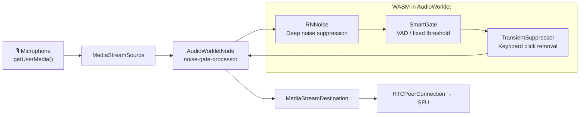
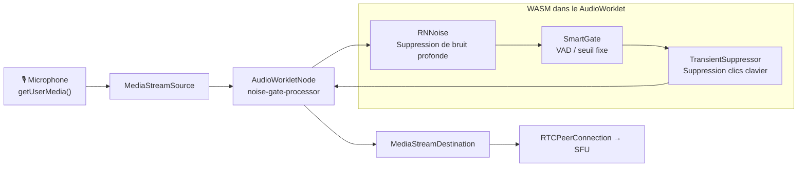

# Void — React Frontend

**React 19** + **Vite 7** + **TypeScript** frontend with **TailwindCSS v4**. Follows a strict architecture: dumb components, business logic in contexts, state changes in hooks.

## Architecture



```mermaid
graph TB
    subgraph "Contexts (Business Logic)"
        AUTH["AuthContext<br/>Local identity + JWT + server sync"]
        VOICE["VoiceContext<br/>WebRTC SFU · WebSocket signaling<br/>AudioWorklet DSP pipeline"]
        STREAM["StreamContext<br/>Screen capture · WASM analyzer worker"]
        CHAT["ChatContext<br/>Messages · localStorage persistence"]
        SERVER["ServerContext<br/>Servers & channels management"]
        TOAST["ToastContext<br/>Ephemeral notifications"]
        BENTO["BentoLayoutContext<br/>Tauri-driven panel layout system"]
    end

    subgraph "Hooks (State Logic)"
        H1["useDashboardState — main orchestrator"]
        H2["useBentoLayout — Tauri IPC bridge"]
        H3["useBentoDrag / useBentoResize"]
        H4["useNetworkStats — WebRTC stats via WASM"]
        H5["usePushToTalk — PTT keybinding"]
        H6["useVoiceActivity — VAD detection"]
        H7["useProfileSettings — profile editing"]
    end

    subgraph "Components (Dumb UI)"
        C_AUTH["auth/ — LoginView"]
        C_CHAN["channel/ — ChannelItem · ChannelList · CreateChannelModal"]
        C_CHAT["chat/ — ChatPanel"]
        C_LAYOUT["layout/ — MainLayout · ChannelPanel · SidebarPanel · TitleBar"]
        C_SETTINGS["settings/ — Activity · Profile · Voice · Update"]
        C_SIDEBAR["sidebar/ — ServerSidebar · SidebarContent · UserFooter · MembersPanel"]
        C_STREAM["stream/ — StreamCard · VoiceAudioRenderer"]
        C_UI["ui/ — Avatar · SelectInput · Modals · ToastContainer"]
    end

    subgraph "API Layer"
        HTTP["http-client.ts<br/>Protobuf + JSON content negotiation"]
        AUTH_API["auth.api.ts<br/>register · login · getMe · search"]
        FRIENDS_WS["friends.ws.ts<br/>WS-RPC: list · pending · send · accept · reject · remove"]
        FRIENDS_BUS["signalingBus.ts<br/>Push events: FriendRequestReceived/Accepted/Removed"]
    end

    subgraph "Workers (Off main thread)"
        WORKLET["noise-gate.worklet.ts<br/>RNNoise + SmartGate + TransientSuppressor"]
        ANALYZER["analyzer.worker.ts<br/>Video frame analysis via WASM"]
    end

    C_AUTH & C_CHAN & C_CHAT & C_LAYOUT & C_SETTINGS & C_SIDEBAR & C_STREAM & C_UI --> AUTH & VOICE & STREAM & CHAT & SERVER & TOAST & BENTO
    AUTH & VOICE & STREAM --> H1 & H2 & H4 & H5 & H6 & H7
    H1 --> HTTP --> AUTH_API & FRIENDS_WS
    H1 --> FRIENDS_BUS
    VOICE --> WORKLET
    STREAM --> ANALYZER
```

## File Structure

```
src/
├── api/                  # HTTP client + endpoint modules
│   ├── http-client.ts    # Protobuf/JSON content negotiation (REST)
│   ├── auth.api.ts       # Auth REST endpoints
│   └── friends.ws.ts     # Friends WS-RPC client (canonical)
├── components/           # Dumb, agnostic UI components
│   ├── auth/             # Login screen
│   ├── channel/          # Channel list, items, creation modal
│   ├── chat/             # Chat panel
│   ├── layout/           # Main layout, sidebar, title bar
│   ├── settings/         # Settings panels (voice, profile, etc.)
│   ├── sidebar/          # Server sidebar, user footer, members
│   ├── stream/           # Stream cards, audio renderer
│   └── ui/               # Shared UI primitives (Avatar, Modals, etc.)
├── context/              # React contexts (all business logic here)
├── hooks/                # Custom hooks (state changes here)
├── lib/                  # Utilities (config, WASM codec, formatters)
├── models/               # TypeScript interfaces (*.model.ts)
├── types/                # TypeScript types (*.types.ts)
├── worker/               # AudioWorklet + analyzer worker sources
├── assets/               # Static assets (logos, images)
└── pkg/                  # Compiled WASM output (core-wasm)
```

## Audio Pipeline



## Conventions

- **Components** must remain stateless and agnostic — no direct API calls
- **Business logic** lives exclusively in `context/`
- **State mutations** happen in `hooks/`
- **Interfaces** in `models/` (`*.model.ts`), **types** in `types/` (`*.types.ts`)
- **Max 350 lines** per file — extract logic if exceeded
- **TailwindCSS v4** for styling, **lucide-react** for icons
- **Comments** in English, JSDoc format

## Scripts

```sh
pnpm dev              # Start Vite dev server (port 1420)
pnpm build            # TypeScript check + Vite production build
pnpm build:worklet    # Compile AudioWorklet to public/worker/
pnpm wasm:build       # Compile core-wasm → src/pkg/
pnpm tauri            # Run Tauri CLI
```

## License

**BSL-1.1** — See [LICENSE](../../LICENSE).

---

# Void — Frontend React (FR)

Frontend **React 19** + **Vite 7** + **TypeScript** avec **TailwindCSS v4**. Architecture stricte : composants muets, logique métier dans les contexts, changements d'état dans les hooks.

## Architecture



```mermaid
graph TB
    subgraph "Contexts (Logique Métier)"
        AUTH["AuthContext<br/>Identité locale + JWT + sync serveur"]
        VOICE["VoiceContext<br/>WebRTC SFU · Signaling WebSocket<br/>Pipeline DSP AudioWorklet"]
        STREAM["StreamContext<br/>Capture d'écran · Worker d'analyse WASM"]
        CHAT["ChatContext<br/>Messages · Persistance localStorage"]
        SERVER["ServerContext<br/>Gestion serveurs & channels"]
        TOAST["ToastContext<br/>Notifications éphémères"]
        BENTO["BentoLayoutContext<br/>Système de layout piloté par Tauri"]
    end

    subgraph "Hooks (Logique d'État)"
        H1["useDashboardState — orchestrateur principal"]
        H2["useBentoLayout — pont IPC Tauri"]
        H3["useBentoDrag / useBentoResize"]
        H4["useNetworkStats — stats WebRTC via WASM"]
        H5["usePushToTalk — raccourci PTT"]
        H6["useVoiceActivity — détection VAD"]
        H7["useProfileSettings — édition de profil"]
    end

    subgraph "Composants (UI muette)"
        C_AUTH["auth/ — LoginView"]
        C_CHAN["channel/ — ChannelItem · ChannelList · CreateChannelModal"]
        C_CHAT["chat/ — ChatPanel"]
        C_LAYOUT["layout/ — MainLayout · ChannelPanel · SidebarPanel · TitleBar"]
        C_SETTINGS["settings/ — Activité · Profil · Voix · Mise à jour"]
        C_SIDEBAR["sidebar/ — ServerSidebar · SidebarContent · UserFooter · MembresPanel"]
        C_STREAM["stream/ — StreamCard · VoiceAudioRenderer"]
        C_UI["ui/ — Avatar · SelectInput · Modals · ToastContainer"]
    end

    subgraph "Couche API"
        HTTP["http-client.ts<br/>Négociation de contenu Protobuf + JSON"]
        AUTH_API["auth.api.ts<br/>register · login · getMe · search"]
        FRIENDS_WS["friends.ws.ts<br/>WS-RPC : list · pending · send · accept · reject · remove"]
        FRIENDS_BUS["signalingBus.ts<br/>Événements push : FriendRequestReceived/Accepted/Removed"]
    end

    subgraph "Workers (Hors thread principal)"
        WORKLET["noise-gate.worklet.ts<br/>RNNoise + SmartGate + TransientSuppressor"]
        ANALYZER["analyzer.worker.ts<br/>Analyse de frames vidéo via WASM"]
    end

    C_AUTH & C_CHAN & C_CHAT & C_LAYOUT & C_SETTINGS & C_SIDEBAR & C_STREAM & C_UI --> AUTH & VOICE & STREAM & CHAT & SERVER & TOAST & BENTO
    AUTH & VOICE & STREAM --> H1 & H2 & H4 & H5 & H6 & H7
    H1 --> HTTP --> AUTH_API & FRIENDS_WS
    H1 --> FRIENDS_BUS
    VOICE --> WORKLET
    STREAM --> ANALYZER
```

## Structure des Fichiers

```
src/
├── api/                  # Client HTTP + modules d'endpoints
├── components/           # Composants UI muets et agnostiques
│   ├── auth/             # Écran de connexion
│   ├── channel/          # Liste de channels, items, modal de création
│   ├── chat/             # Panel de chat
│   ├── layout/           # Layout principal, sidebar, barre de titre
│   ├── settings/         # Panels de paramètres (voix, profil, etc.)
│   ├── sidebar/          # Sidebar serveur, footer utilisateur, membres
│   ├── stream/           # Cartes de stream, renderer audio
│   └── ui/               # Primitives UI partagées (Avatar, Modals, etc.)
├── context/              # Contexts React (toute la logique métier ici)
├── hooks/                # Hooks custom (changements d'état ici)
├── lib/                  # Utilitaires (config, codec WASM, formateurs)
├── models/               # Interfaces TypeScript (*.model.ts)
├── types/                # Types TypeScript (*.types.ts)
├── worker/               # Sources AudioWorklet + worker d'analyse
├── assets/               # Ressources statiques (logos, images)
└── pkg/                  # Sortie WASM compilée (core-wasm)
```

## Pipeline Audio



## Conventions

- Les **composants** doivent rester stateless et agnostiques — pas d'appels API directs
- La **logique métier** vit exclusivement dans `context/`
- Les **mutations d'état** se font dans `hooks/`
- Les **interfaces** dans `models/` (`*.model.ts`), les **types** dans `types/` (`*.types.ts`)
- **350 lignes max** par fichier — extraire la logique si dépassé
- **TailwindCSS v4** pour le style, **lucide-react** pour les icônes
- **Commentaires** en anglais, format JSDoc

## Scripts

```sh
pnpm dev              # Lancer le serveur dev Vite (port 1420)
pnpm build            # Vérification TypeScript + build production Vite
pnpm build:worklet    # Compiler l'AudioWorklet dans public/worker/
pnpm wasm:build       # Compiler core-wasm → src/pkg/
pnpm tauri            # Lancer le CLI Tauri
```

## Licence

**BSL-1.1** — Voir [LICENSE](../../LICENSE).
