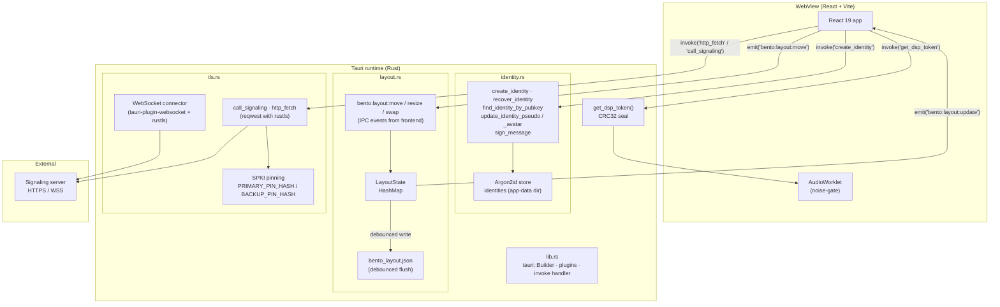
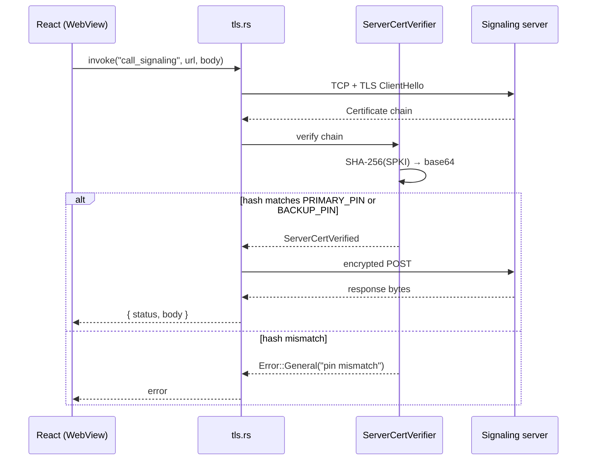

# Void — Tauri Native Backend
Native shell of the Void desktop application, built with **Tauri v2**. Owns the things the React frontend cannot do safely on its own:
- **Local identity** — Ed25519 keypair generation, Argon2id-protected disk store, signing service.
- **Bento layout state** — persistent, percent-based window arrangement state with debounced disk flush and live IPC fan-out.
- **TLS / network egress** — outbound HTTP+WebSocket clients pinned against compile-time SPKI hashes (no MITM downgrade).
- **DSP runtime seal** — deterministic CRC token used by the audio worklet to refuse to start without the native shell.
> **License:** Business Source License 1.1 (BSL-1.1) — see the repository [`LICENSE`](../../../LICENSE).

---

## Why a Rust shell?

Putting these concerns in the WebView would expose:

- private keys to any compromised JS dependency,
- raw bytes of the password hash to debugger / extensions,
- TLS trust decisions to the platform's certificate store (broad on consumer machines).

The native shell keeps the secret material **outside the WebView's address space** and only exposes signed, scoped IPC commands to the React layer.

---

## Architecture



---

## Tauri commands (IPC)

| Command | Module | Description |
|---|---|---|
| `create_identity` | `identity` | Generates an Ed25519 keypair, hashes the password with Argon2id, persists it to the app-data store. |
| `recover_identity` | `identity` | Re-binds an existing keypair to the local store from an external backup. |
| `find_identity_by_pubkey` | `identity` | Lookup helper used by the login flow. |
| `update_identity_pseudo` | `identity` | Mutates the displayed pseudonym for the active identity. |
| `update_identity_avatar` | `identity` | Mutates the avatar reference. |
| `sign_message` | `identity` | Signs a host-supplied byte slice with the active Ed25519 secret key. |
| `call_signaling` | `tls` | Pinned HTTPS POST to the signaling server (auth, friends, presence). |
| `http_fetch` | `tls` | Generic pinned HTTP fetch for first-party origins. |
| `get_dsp_token` | `lib` | CRC32 seal used by the AudioWorklet to refuse running outside the trusted native shell. |

The full list is registered in [`src/lib.rs`](./src/lib.rs) inside the `invoke_handler!` macro.

### Bento layout events

The layout state machine listens to events emitted by the frontend (instead of regular `invoke` calls) so that drag/resize loops never serialize a return value:

| Event (frontend → backend) | Payload | Effect |
|---|---|---|
| `bento:layout:move` | `MovePayload { id, x, y }` | Translates window `id` to `(x, y)` (percent-based). |
| `bento:layout:resize` | `ResizePayload { id, w, h }` | Resizes window `id` to `(w, h)`. |
| `bento:layout:swap` | `SwapPayload { a, b }` | Swaps two windows' positions. |
| `bento:layout:update` | `LayoutBatch { windows }` | Backend → frontend broadcast after every state change. |

Disk persistence is **debounced**: rapid drag streams batch into a single write to `bento_layout.json` in the app-data directory.

---

## TLS pinning



Hashes are injected at compile time via the `PRIMARY_PIN_HASH` / `BACKUP_PIN_HASH` env variables. When neither is set, the build is flagged via `tls::is_dev_build()` and accepts any cert (development only).

---

## File layout

```
src-tauri/
├── Cargo.toml
├── tauri.conf.json
├── icons/
└── src/
    ├── main.rs        # Binary entry → calls lib::run()
    ├── lib.rs         # tauri::Builder bootstrap + invoke_handler + DSP seal
    ├── identity.rs    # Identity store, Argon2id hashing, Ed25519 signing
    ├── layout.rs      # Bento layout state machine + disk persistence
    └── tls.rs         # rustls config, SPKI pinning, HTTP/WS clients
```

---

## Build

```bash
# Dev (hot reload, opens the WebView and the Vite dev server)
pnpm tauri dev

# Production bundle (.exe / .dmg / .deb depending on host)
pnpm tauri build
```

Compile-time pin injection (production):

```bash
PRIMARY_PIN_HASH=<base64-spki-hash> \
BACKUP_PIN_HASH=<base64-spki-hash> \
  pnpm tauri build
```

---

## Tests

```bash
cargo test -p desktop
```

Inline unit tests live in each module (`identity.rs`, `layout.rs`, `tls.rs`, `lib.rs`). They cover:

- DSP token determinism,
- layout batch serialization round-trip,
- identity hashing/verification,
- pin parsing and `is_dev_build` detection.

---

## API documentation

```bash
cargo doc -p desktop --no-deps --open
```

Output: `target/doc/desktop_lib/index.html`.

---

# Void — Backend Natif Tauri (FR)

Coque native de l'application desktop Void, construite avec **Tauri v2**. Prend en charge ce que le frontend React ne peut pas faire en sécurité depuis la WebView :

- **Identité locale** — génération Ed25519, store sur disque protégé par Argon2id, service de signature.
- **État de layout Bento** — disposition des fenêtres en pourcentages, persistance debouncée, fan-out IPC live.
- **Sortie TLS / réseau** — clients HTTP+WebSocket épinglés à des empreintes SPKI compilées (pas de downgrade MITM).
- **Sceau du runtime DSP** — token CRC déterministe que le worklet audio utilise pour refuser de démarrer sans la coque native.

> **Licence :** Business Source License 1.1 (BSL-1.1) — voir [`LICENSE`](../../../LICENSE) à la racine du dépôt.

---

## Pourquoi une coque Rust ?

Mettre ces responsabilités dans la WebView exposerait :

- les clés privées à n'importe quelle dépendance JS compromise,
- les octets bruts du hash de mot de passe au debugger / aux extensions,
- les décisions de confiance TLS au store de certificats de la machine (très large sur un poste grand public).

La coque native garde le matériel secret **hors de l'espace d'adressage de la WebView** et n'expose que des commandes IPC signées et bornées au layer React.

---

## Commandes Tauri (IPC)

| Commande | Module | Description |
|---|---|---|
| `create_identity` | `identity` | Génère un keypair Ed25519, hash le mot de passe avec Argon2id, persiste dans le store app-data. |
| `recover_identity` | `identity` | Ré-importe un keypair existant depuis un backup externe. |
| `find_identity_by_pubkey` | `identity` | Helper de lookup utilisé par le flux de connexion. |
| `update_identity_pseudo` | `identity` | Met à jour le pseudonyme affiché. |
| `update_identity_avatar` | `identity` | Met à jour la référence d'avatar. |
| `sign_message` | `identity` | Signe un slice fourni par le host avec la clé Ed25519 active. |
| `call_signaling` | `tls` | POST HTTPS épinglé vers le serveur de signalisation. |
| `http_fetch` | `tls` | Fetch HTTP épinglé générique pour les origines de premier plan. |
| `get_dsp_token` | `lib` | Sceau CRC32 utilisé par l'AudioWorklet pour refuser de tourner hors de la coque native. |

### Événements de layout Bento

| Événement (frontend → backend) | Payload | Effet |
|---|---|---|
| `bento:layout:move` | `MovePayload { id, x, y }` | Translate la fenêtre `id` à `(x, y)` (en pourcentages). |
| `bento:layout:resize` | `ResizePayload { id, w, h }` | Redimensionne la fenêtre `id` à `(w, h)`. |
| `bento:layout:swap` | `SwapPayload { a, b }` | Échange la position de deux fenêtres. |
| `bento:layout:update` | `LayoutBatch { windows }` | Diffusion backend → frontend après chaque mutation. |

La persistance disque est **debouncée** : un flux rapide de drag est aggloméré en une seule écriture vers `bento_layout.json` dans le répertoire de données de l'application.

---

## Pinning TLS

Les empreintes SPKI sont injectées à la compilation via les variables `PRIMARY_PIN_HASH` / `BACKUP_PIN_HASH`. Quand aucune n'est définie, le build est marqué via `tls::is_dev_build()` et accepte n'importe quel certificat (dev uniquement).

```bash
PRIMARY_PIN_HASH=<base64-spki-hash> \
BACKUP_PIN_HASH=<base64-spki-hash> \
  pnpm tauri build
```

---

## Compilation

```bash
# Dev (hot reload, ouvre la WebView et le serveur Vite)
pnpm tauri dev

# Bundle de production (.exe / .dmg / .deb selon l'hôte)
pnpm tauri build
```

---

## Tests & documentation

```bash
cargo test -p desktop
cargo doc  -p desktop --no-deps --open
```

Sortie de la doc : `target/doc/desktop_lib/index.html`.

