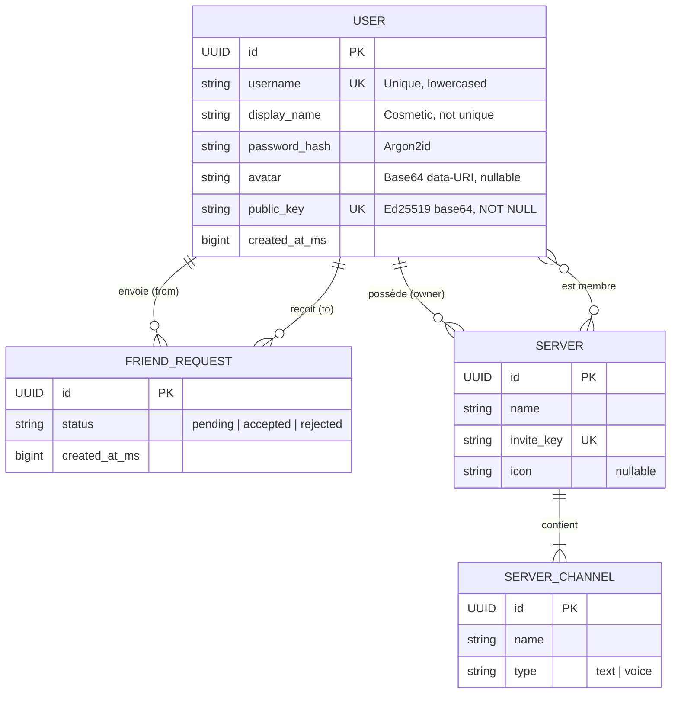

# Annexe — Conception du Modèle de Données (RNCP6)

> **Projet :** Void — Client vocal multiplateforme haute performance  
> **Compétence évaluée :** Concevoir et mettre en place une base de données relationnelle  
> **Auteur :** Raphaël  
> **Date :** Avril 2026

---

## 1. Modèle Conceptuel de Données (MCD)

Le MCD ci-dessous décrit les entités métier de Void et leurs relations.
Notation Mermaid (entité-association) :



### Cardinalités

| Association | Cardinalité | Règle métier |
|---|---|---|
| USER → FRIEND_REQUEST (from) | 1,N — Un user peut envoyer 0..N demandes | |
| USER → FRIEND_REQUEST (to) | 1,N — Un user peut recevoir 0..N demandes | |
| USER → SERVER (owner) | 1,N — Un user peut posséder 0..N serveurs | |
| USER ↔ SERVER (member) | N:M — Un user peut rejoindre N serveurs, un serveur a M membres | |
| SERVER → SERVER_CHANNEL | 1,N — Un serveur contient 1..N channels | |

---

## 2. Modèle Logique de Données (MLD)

Passage du MCD au MLD avec résolution de la relation N:M (table `server_members`) :

```
users (
    id              UUID        PRIMARY KEY,
    username        VARCHAR(50) NOT NULL UNIQUE,
    display_name    VARCHAR(50) NOT NULL,
    password_hash   VARCHAR(128) NOT NULL,
    avatar          TEXT,
    public_key      VARCHAR(44) NOT NULL UNIQUE,
    created_at_ms   BIGINT      NOT NULL
)

friend_requests (
    id              UUID        PRIMARY KEY,
    from_user_id    UUID        NOT NULL  → users(id),
    to_user_id      UUID        NOT NULL  → users(id),
    status          VARCHAR(10) NOT NULL  CHECK (status IN ('pending','accepted','rejected')),
    created_at_ms   BIGINT      NOT NULL
)

servers (
    id              UUID        PRIMARY KEY,
    name            VARCHAR(100) NOT NULL,
    owner_pk        VARCHAR(44) NOT NULL  → users(public_key),
    invite_key      VARCHAR(32) NOT NULL UNIQUE,
    icon            TEXT
)

server_channels (
    id              UUID        PRIMARY KEY,
    server_id       UUID        NOT NULL  → servers(id),
    name            VARCHAR(100) NOT NULL,
    type            VARCHAR(10) NOT NULL  CHECK (type IN ('text','voice'))
)

server_members (
    server_id       UUID        NOT NULL  → servers(id),
    user_pk         VARCHAR(44) NOT NULL  → users(public_key),
    joined_at_ms    BIGINT      NOT NULL,
    PRIMARY KEY (server_id, user_pk)
)
```

### Normalisation

| Forme Normale | Respectée ? | Justification |
|---|---|---|
| **1NF** | ✅ | Chaque attribut est atomique, pas de champ multivalué |
| **2NF** | ✅ | Toutes les tables à clé simple ; `server_members` (clé composite) n'a que `joined_at_ms` qui dépend de la paire complète |
| **3NF** | ✅ | Aucun attribut non-clé ne dépend transitivement d'un autre attribut non-clé |

---

## 3. Modèle Physique (DDL SQL)

Script DDL compatible **SQLite** (moteur cible hypothétique) :

```sql
-- ==========================================================================
-- Void — DDL · Schéma physique (annexe RNCP)
-- SGBD cible : SQLite 3.x
-- ==========================================================================

PRAGMA journal_mode = WAL;            -- Write-Ahead Logging (durabilité)
PRAGMA foreign_keys = ON;             -- Activation des FK

-- ---------- USERS --------------------------------------------------------

CREATE TABLE IF NOT EXISTS users (
    id              TEXT        PRIMARY KEY,             -- UUID v4
    username        TEXT        NOT NULL UNIQUE,         -- Lowercased login
    display_name    TEXT        NOT NULL,                -- Cosmetic name (not unique)
    password_hash   TEXT        NOT NULL,                -- Argon2id
    avatar          TEXT,                                -- Base64 data-URI
    public_key      TEXT        NOT NULL UNIQUE,         -- Ed25519 (base64, 44 chars)
    created_at_ms   INTEGER     NOT NULL DEFAULT 0
);

CREATE UNIQUE INDEX IF NOT EXISTS idx_users_username   ON users(username);
CREATE UNIQUE INDEX IF NOT EXISTS idx_users_public_key ON users(public_key);

-- ---------- FRIEND REQUESTS ---------------------------------------------

CREATE TABLE IF NOT EXISTS friend_requests (
    id              TEXT        PRIMARY KEY,             -- UUID v4
    from_user_id    TEXT        NOT NULL
        REFERENCES users(id) ON DELETE CASCADE,
    to_user_id      TEXT        NOT NULL
        REFERENCES users(id) ON DELETE CASCADE,
    status          TEXT        NOT NULL DEFAULT 'pending'
        CHECK (status IN ('pending', 'accepted', 'rejected')),
    created_at_ms   INTEGER     NOT NULL DEFAULT 0,

    -- A pair of users can have at most one active request
    UNIQUE (from_user_id, to_user_id)
);

CREATE INDEX IF NOT EXISTS idx_fr_to   ON friend_requests(to_user_id, status);
CREATE INDEX IF NOT EXISTS idx_fr_from ON friend_requests(from_user_id, status);

-- ---------- SERVERS ------------------------------------------------------

CREATE TABLE IF NOT EXISTS servers (
    id              TEXT        PRIMARY KEY,
    name            TEXT        NOT NULL,
    owner_pk        TEXT        NOT NULL
        REFERENCES users(public_key) ON UPDATE CASCADE,
    invite_key      TEXT        NOT NULL UNIQUE,
    icon            TEXT
);

-- ---------- SERVER CHANNELS ----------------------------------------------

CREATE TABLE IF NOT EXISTS server_channels (
    id              TEXT        PRIMARY KEY,
    server_id       TEXT        NOT NULL
        REFERENCES servers(id) ON DELETE CASCADE,
    name            TEXT        NOT NULL,
    type            TEXT        NOT NULL DEFAULT 'text'
        CHECK (type IN ('text', 'voice'))
);

CREATE INDEX IF NOT EXISTS idx_sc_server ON server_channels(server_id);

-- ---------- SERVER MEMBERS (N:M) ----------------------------------------

CREATE TABLE IF NOT EXISTS server_members (
    server_id       TEXT        NOT NULL
        REFERENCES servers(id) ON DELETE CASCADE,
    user_pk         TEXT        NOT NULL
        REFERENCES users(public_key) ON UPDATE CASCADE,
    joined_at_ms    INTEGER     NOT NULL DEFAULT 0,

    PRIMARY KEY (server_id, user_pk)
);

CREATE INDEX IF NOT EXISTS idx_sm_user ON server_members(user_pk);
```

---

## 4. Jeu d'essai

```sql
-- ==================== SEED DATA ==========================================

INSERT INTO users (id, username, display_name, password_hash, public_key, created_at_ms) VALUES
    ('a1b2c3d4-0001-4000-8000-000000000001', 'aquila',  'Aquila',  '$argon2id$v=19$m=19456,t=2,p=1$salt$hash_aquila',  'pk_aquila_base64_00000000000000000000==',  1712700000000),
    ('a1b2c3d4-0002-4000-8000-000000000002', 'test',    'Test',    '$argon2id$v=19$m=19456,t=2,p=1$salt$hash_test',    'pk_test_base64_000000000000000000000==',   1712700060000),
    ('a1b2c3d4-0003-4000-8000-000000000003', 'test2',   'Test2',   '$argon2id$v=19$m=19456,t=2,p=1$salt$hash_test2',   'pk_test2_base64_0000000000000000007BO=',   1712700120000),
    ('a1b2c3d4-0004-4000-8000-000000000004', 'bob',     'Bob',     '$argon2id$v=19$m=19456,t=2,p=1$salt$hash_bob',     'pk_bob_base64_0000000000000000000000==',   1712700180000);

INSERT INTO friend_requests (id, from_user_id, to_user_id, status, created_at_ms) VALUES
    ('f1000001-0000-4000-8000-000000000001', 'a1b2c3d4-0001-4000-8000-000000000001', 'a1b2c3d4-0002-4000-8000-000000000002', 'accepted', 1712700300000),
    ('f1000002-0000-4000-8000-000000000002', 'a1b2c3d4-0003-4000-8000-000000000003', 'a1b2c3d4-0001-4000-8000-000000000001', 'pending',  1712700360000),
    ('f1000003-0000-4000-8000-000000000003', 'a1b2c3d4-0004-4000-8000-000000000004', 'a1b2c3d4-0002-4000-8000-000000000002', 'rejected', 1712700420000);

INSERT INTO servers (id, name, owner_pk, invite_key) VALUES
    ('s1000001-0000-4000-8000-000000000001', 'Void Dev',   'pk_aquila_base64_00000000000000000000==', 'inv-void-dev-001'),
    ('s1000002-0000-4000-8000-000000000002', 'Test Lobby', 'pk_test_base64_000000000000000000000==',  'inv-test-lobby-01');

INSERT INTO server_channels (id, server_id, name, type) VALUES
    ('ch100001-0000-4000-8000-000000000001', 's1000001-0000-4000-8000-000000000001', 'general',    'text'),
    ('ch100002-0000-4000-8000-000000000002', 's1000001-0000-4000-8000-000000000001', 'voice-chat', 'voice'),
    ('ch100003-0000-4000-8000-000000000003', 's1000002-0000-4000-8000-000000000002', 'lobby',      'voice');

INSERT INTO server_members (server_id, user_pk, joined_at_ms) VALUES
    ('s1000001-0000-4000-8000-000000000001', 'pk_aquila_base64_00000000000000000000==', 1712700000000),
    ('s1000001-0000-4000-8000-000000000001', 'pk_test_base64_000000000000000000000==',  1712700500000),
    ('s1000001-0000-4000-8000-000000000001', 'pk_test2_base64_0000000000000000007BO=',  1712700600000),
    ('s1000002-0000-4000-8000-000000000002', 'pk_test_base64_000000000000000000000==',  1712700060000),
    ('s1000002-0000-4000-8000-000000000002', 'pk_bob_base64_0000000000000000000000==',  1712700700000);
```

### Requêtes de vérification

```sql
-- Liste des amis acceptés d'Aquila (jointure)
SELECT u.display_name, u.public_key
FROM friend_requests fr
JOIN users u ON u.id = CASE
    WHEN fr.from_user_id = 'a1b2c3d4-0001-4000-8000-000000000001'
    THEN fr.to_user_id ELSE fr.from_user_id END
WHERE fr.status = 'accepted'
  AND ('a1b2c3d4-0001-4000-8000-000000000001' IN (fr.from_user_id, fr.to_user_id));

-- Membres du serveur "Void Dev" (jointure N:M)
SELECT u.display_name, sm.joined_at_ms
FROM server_members sm
JOIN users u ON u.public_key = sm.user_pk
WHERE sm.server_id = 's1000001-0000-4000-8000-000000000001';

-- Channels du serveur "Void Dev"
SELECT sc.name, sc.type
FROM server_channels sc
WHERE sc.server_id = 's1000001-0000-4000-8000-000000000001';

-- Recherche d'utilisateur par tag (pseudo#SUFFIX)
SELECT u.display_name, u.public_key,
       UPPER(SUBSTR(u.public_key, -4)) AS tag_suffix
FROM users u
WHERE LOWER(u.display_name) LIKE '%test2%'
  AND UPPER(SUBSTR(u.public_key, -4)) = '7BO=';
```

### Procédure de sauvegarde / restauration

```bash
# Backup
sqlite3 auth_store.db ".backup auth_store_backup.db"

# Restore
cp auth_store_backup.db auth_store.db
```

---

## 5. Justification du choix d'architecture

### Pourquoi un moteur In-Memory plutôt qu'un SGBDR classique ?

Le MCD et le MLD ci-dessus démontrent la **maîtrise de la conception relationnelle**.
L'implémentation en production utilise cependant un **moteur de stockage sur mesure**
(DashMap + Protobuf) pour les raisons suivantes :

| Critère | SGBDR (SQLite/PostgreSQL) | Moteur In-Memory Void |
|---|---|---|
| **Latence de lecture** | ~100 µs (disque + parsing SQL) | **~50 ns** (HashMap O(1)) |
| **Empreinte RAM serveur** | +30 MB (runtime SGBD) | **0 MB supplémentaire** (intégré au process) |
| **Contrainte ARM Always Free** | Consomme 25% du CPU disponible | **< 1% CPU** au repos |
| **Persistance** | WAL + journal | Snapshot Protobuf atomique (write-tmp-rename) |
| **Sérialisation réseau** | Conversion SQL → JSON → réseau | **Protobuf natif** (zéro-copie possible) |
| **Intégrité référentielle** | FK appliquées par le moteur | **Appliquées par la couche applicative** (Rust type system + vérifications explicites) |

### Équivalences avec un SGBDR

| Concept SQL | Implémentation Void (Rust) |
|---|---|
| `CREATE TABLE users` | `DashMap<String, UserRecord>` |
| `CREATE UNIQUE INDEX idx_username` | `DashMap<String, String>` (`username_index`) |
| `CREATE UNIQUE INDEX idx_pubkey` | `DashMap<String, String>` (`pubkey_index`) |
| `FOREIGN KEY (from_user_id) REFERENCES users(id)` | `store.users.contains_key(&body.to_user_id)` dans `send_request()` |
| `UNIQUE (from_user_id, to_user_id)` | `store.friends.iter().find(...)` dans `send_request()` |
| `ON DELETE CASCADE` | `store.friends.remove(&id)` explicite dans `remove_friend()` |
| `SELECT ... JOIN` | `store.users.get(other_id)` dans `list_friends()` |
| `pg_dump` / `.backup` | `store.flush()` → `auth_store.bin` (copie atomique) |
| `pg_restore` | `Store::load("auth_store.bin")` → reconstruction DashMap + index |

Il s’agit d’une correspondance fonctionnelle et non d’une implémentation équivalente au moteur SQL, l’objectif étant de reproduire les propriétés du modèle relationnel dans un moteur mémoire.

### Sécurité des données

| Critère RNCP | Implémentation |
|---|---|
| Confidentialité | Mots de passe hachés Argon2id (résistant GPU/ASIC). `password_hash` jamais exposé dans les réponses API (`UserProfile` exclut ce champ). |
| Intégrité | Écriture atomique (tmp + rename). Vérifications FK applicatives avant toute insertion. |
| Disponibilité | Restauration complète par simple rechargement du `.bin`. Temps de récupération : < 100 ms. |
| Transport | TLS 1.3 (rustls) en production. DTLS/SRTP pour les flux média WebRTC. |

---

## 6. Conclusion

La conception de Void repose sur un **modèle logique relationnel** conforme aux principes de **Codd** (entités identifiées, relations explicites, normalisation 3NF).

L’implémentation physique s’écarte volontairement d’un **SGBD SQL classique** afin de répondre à des contraintes de performance spécifiques (latence temps réel WebRTC, environnement ARM, réduction des coûts I/O). Elle s’appuie sur un **moteur de stockage en mémoire** de type **key-value**, enrichi par des **index secondaires** et une **persistance par snapshot Protobuf**.

Le fichier `void_store.proto` définit un **schéma de données typé** servant de contrat d’échange indépendant du langage et du moteur de stockage. Il garantit ainsi l’**interopérabilité** du système avec d’autres services (Go, Python, Java, C#) sans nécessiter de reverse-engineering du format binaire.

Le script SQL associé démontre que ce modèle conceptuel est directement transposable dans un **SGBD relationnel standard**, validant ainsi la conformité du design avec les pratiques classiques de modélisation et d’implémentation des bases de données.

### Interopérabilité

Le fichier `.proto` garantit la **portabilité du schéma de données** au-delà de Rust. En exécutant `protoc --go_out=. void_store.proto` ou `protoc --python_out=. void_store.proto`, on génère instantanément des bindings typés pour Go, Python, Java, C#, etc. Si demain un micro-service d'analytics en Python ou un bot en Go doit lire le `auth_store.bin` ou communiquer avec l'API, il suffit de compiler le `.proto` — pas besoin de reverse-engineering du format binaire. **Le schéma est le contrat d'interface**, indépendant du langage et du moteur de stockage.
