# core-wasm


High-performance Rust → WebAssembly module powering the Void client.  
Handles **real-time DSP**, **media analysis**, **network scoring** and **protobuf codec** — all off the JS main thread.

---

## Architecture Overview

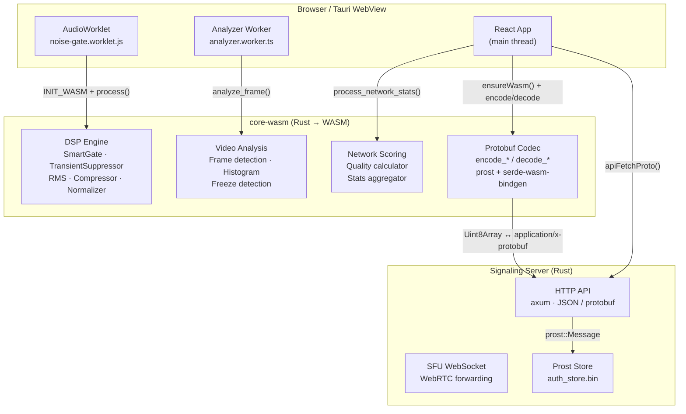

---

## Module Map

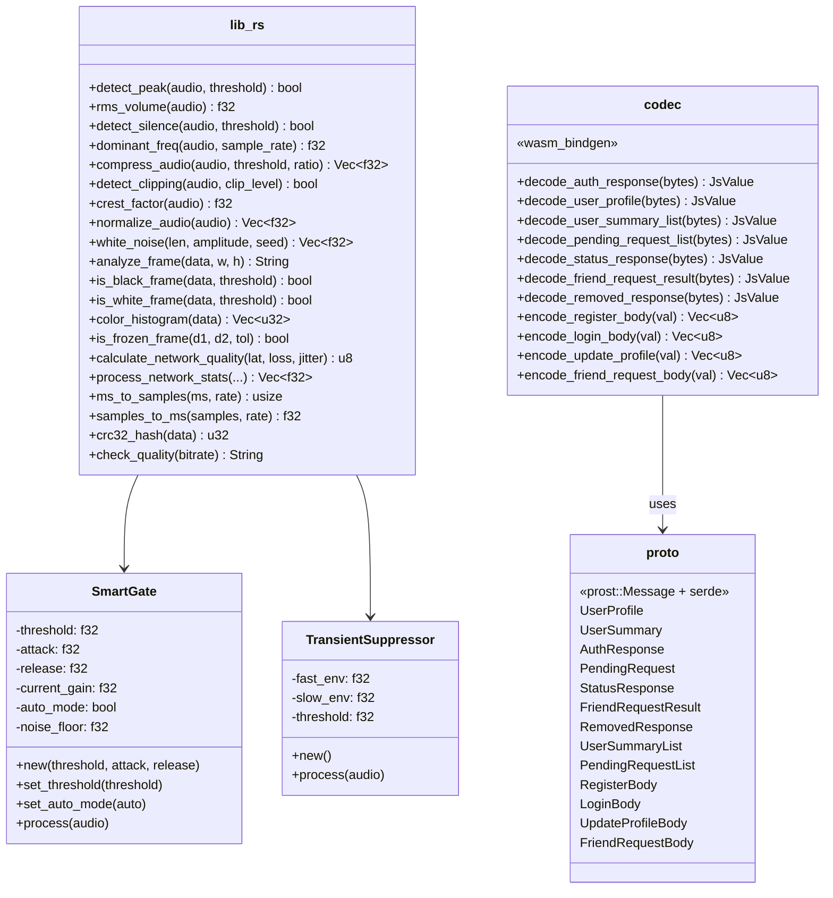

---

## Protobuf Codec — Content Negotiation Flow

The codec module replaces JSON serialization with binary protobuf for all HTTP API communication.  
Tag numbers are synchronized with `packages/signaling-server/src/models.rs`.

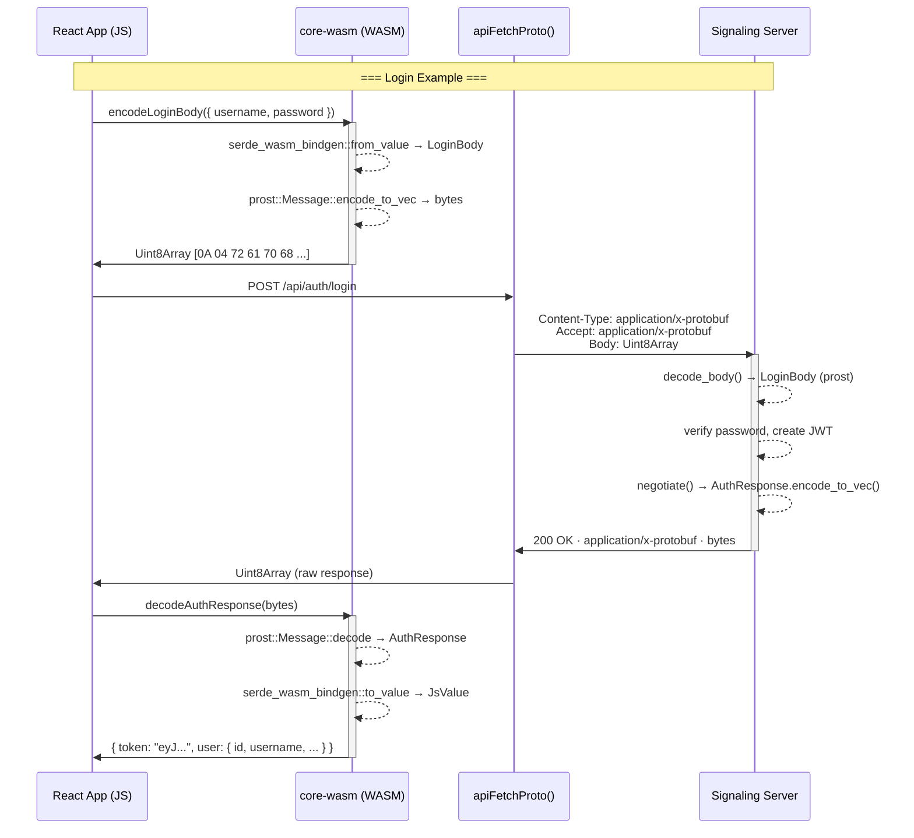

### Backward Compatibility

The server performs **content negotiation**: if the `Accept` header does not contain `application/x-protobuf`, responses fall back to JSON. This ensures `curl`, browser dev tools, and legacy clients still work.

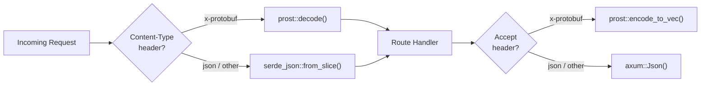

---

## Protobuf Schema (prost derive — no `.proto` file)

All types use `prost::Message` derive macros. Tag numbers define the wire format.

| Message | Tag 1 | Tag 2 | Tag 3 | Tag 4 | Tag 5 | Tag 6 |
|---|---|---|---|---|---|---|
| **UserProfile** | `id` string | `username` string | `display_name` string | `avatar` string? | `public_key` string? | `created_at_ms` int64 |
| **UserSummary** | `id` string | `username` string | `display_name` string | `avatar` string? | — | — |
| **AuthResponse** | `token` string | `user` UserProfile? | — | — | — | — |
| **PendingRequest** | `id` string | `from` UserSummary? | `created_at_ms` int64 | — | — | — |
| **RegisterBody** | `username` string | `password` string | `display_name` string | `public_key` string? | — | — |
| **LoginBody** | `username` string | `password` string | — | — | — | — |
| **UpdateProfileBody** | `display_name` string? | `avatar` string? | — | — | — | — |
| **FriendRequestBody** | `to_user_id` string | — | — | — | — | — |
| **StatusResponse** | `status` string | — | — | — | — | — |
| **FriendRequestResult** | `id` string | `status` string | — | — | — | — |
| **RemovedResponse** | `removed` bool | — | — | — | — | — |
| **UserSummaryList** | `items` UserSummary[] | — | — | — | — | — |
| **PendingRequestList** | `items` PendingRequest[] | — | — | — | — | — |

> **Critical:** tag numbers MUST stay in sync between `core-wasm/src/proto.rs` and `signaling-server/src/models.rs`.

---

## DSP Pipeline — Audio Processing

The `SmartGate` and `TransientSuppressor` run inside an `AudioWorkletProcessor`, called 128 samples at a time at 48 kHz.

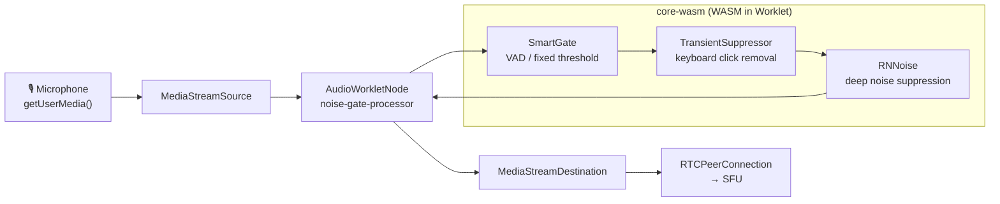

### SmartGate Algorithm

```
if auto_mode:
    noise_floor += (rms - noise_floor) × 0.0001     # slow adaptation
    open = rms > max(noise_floor × 4, 0.005)
else:
    open = rms > threshold

gain → attack/release smoothing per sample
output = input × gain
```

### TransientSuppressor Algorithm

```
fast_envelope = fast_env × 0.9  + |sample| × 0.1     # ~1ms  @48kHz
slow_envelope = slow_env × 0.999 + |sample| × 0.001   # ~20ms @48kHz

if fast_envelope > slow_envelope × 4.0:
    gain = (slow × 4 / fast) ^ 1.5                    # soft-knee reduction
    sample *= gain
```

---

## Network Quality Scoring

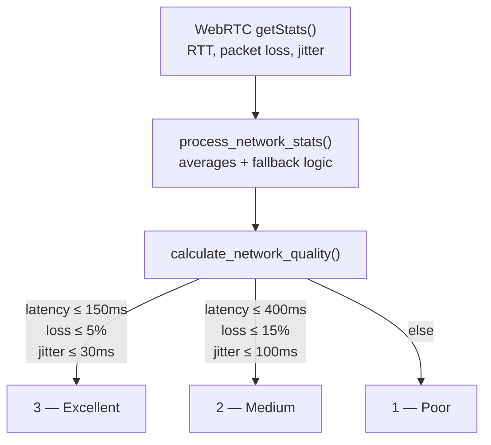

Returns `[ping, packetLoss%, jitter, quality, rawRtt]` as `Float32Array`.

---

## Build & Integration

### Prerequisites

- Rust toolchain with `wasm32-unknown-unknown` target
- [`wasm-pack`](https://rustwasm.github.io/wasm-pack/) ≥ 0.13

### Compile

```bash
# From monorepo root (or use pnpm wasm:build from apps/desktop)
cd packages/core-wasm
wasm-pack build --target web --out-dir ../../apps/desktop/src/pkg
```

Output lands in `apps/desktop/src/pkg/`:

| File | Purpose |
|---|---|
| `core_wasm.js` | JS glue (ESM, `init()` + function exports) |
| `core_wasm.d.ts` | TypeScript declarations |
| `core_wasm_bg.wasm` | Compiled WASM binary |

### Frontend Usage

```typescript
// Singleton init (call once, safe to call multiple times)
import { ensureWasm, decodeUserProfile, encodeLoginBody } from './lib/wasm-codec';

await ensureWasm();

// Encode a request body → Uint8Array
const bytes = encodeLoginBody({ username: "raph", password: "1234" });

// Decode a protobuf response → typed JS object
const profile = decodeUserProfile(responseBytes) as UserProfile;
```

### AudioWorklet Usage

```javascript
// Inside the worklet processor
const wasmBuffer = event.data.wasmBuffer;
await initWasm(wasmBuffer);

const gate = new SmartGate(0.01, 0.01, 0.1);
gate.set_auto_mode(true);

const suppressor = new TransientSuppressor();

// Per audio block (128 samples @ 48kHz)
gate.process(audioBuffer);
suppressor.process(audioBuffer);
```

---

## Dependencies

| Crate | Version | Role |
|---|---|---|
| `wasm-bindgen` | 0.2 | JS ↔ WASM bridge |
| `prost` | 0.13 | Protobuf encode/decode (no `.proto` needed) |
| `serde` | 1.0 | Serialization framework |
| `serde-wasm-bindgen` | 0.6 | `JsValue` ↔ Rust struct conversion |
| `crc32fast` | 1.5 | Fast CRC32 checksums |

---

## File Structure

```
packages/core-wasm/
├── Cargo.toml
├── README.md
├── benches/
│   └── dsp.rs           # Criterion benchmarks (native target, --features bench)
├── tests/
└── src/
    ├── lib.rs          # DSP, video, network functions + SmartGate + TransientSuppressor
    ├── proto.rs         # Protobuf message types (prost derive, synced with server)
    └── codec.rs         # wasm_bindgen encode/decode functions
```

---

## Benchmarks (criterion)

The crate ships a [`criterion`](https://github.com/bheisler/criterion.rs) suite that
profiles the DSP hot paths on the **native** target (criterion cannot run inside
wasm32). The benches mirror the realistic frame sizes used by the
`AudioWorkletProcessor` (10 ms / 20 ms @ 48 kHz) and the analyzer worker
(320×180 RGBA frames).

### Run

```bash
cargo bench -p core-wasm --features bench
```

> The `bench` feature exposes a `__bench_compute_seal()` helper so criterion
> can activate the runtime context and exercise the *real* hot path of
> `SmartGate::process` / `TransientSuppressor::process` rather than the
> degraded fallback. This feature **must never** be enabled in production
> or wasm builds.

### Coverage

| Group | Benchmarks |
|---|---|
| `audio_analysis` | `detect_peak`, `rms_volume`, `detect_silence`, `detect_clipping`, `crest_factor`, `dominant_freq` (480 / 960 / 4096 samples) |
| `audio_fx` | `compress_audio`, `normalize_audio`, `white_noise_960` |
| `processors` | `smart_gate_manual`, `smart_gate_auto`, `transient_suppressor` |
| `hash_and_video` | `crc32_hash_4k`, `compute_fingerprint`, `color_histogram_320x180`, `is_frozen_frame_320x180` |

### Indicative results (native x86_64, release)

| Hot path | Frame | Median | Throughput |
|---|---|---|---|
| `detect_peak` | 480 | 4.15 ns | ~114 Gelem/s |
| `rms_volume` | 480 | 380 ns | ~1.26 Gelem/s |
| `compress_audio` | 960 | 3.77 µs | ~255 Melem/s |
| `SmartGate.process` (auto) | 960 | 2.08 µs | ~460 Melem/s |
| `TransientSuppressor.process` | 960 | 2.50 µs | ~384 Melem/s |
| `crc32_hash` | 4 KiB | 2.69 µs | ~1.41 GiB/s |
| `color_histogram` | 320×180 | 92.8 µs | ~2.31 GiB/s |

These numbers are reference points only — actual wasm32 throughput in the
worklet will differ; treat criterion runs as **regression detectors**, not as
absolute SLA values.

> Note: a real out-of-bounds bug in `dominant_freq` was uncovered while
> bringing up the benchmark suite (autocorrelation `max_lag` was not clamped
> to the buffer length, causing a panic on 10 ms WebRTC frames). It has been
> fixed in `lib.rs` — see commit history.

---

# core-wasm (FR)

Module Rust → WebAssembly haute performance au cœur du client Void.  
Gère le **traitement audio temps réel (DSP)**, l'**analyse média**, le **scoring réseau** et le **codec protobuf** — le tout hors du thread principal JS.

---

## Vue d'ensemble de l'architecture

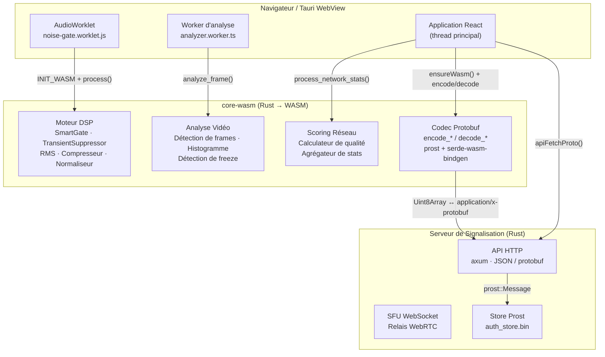

---

## Carte des modules

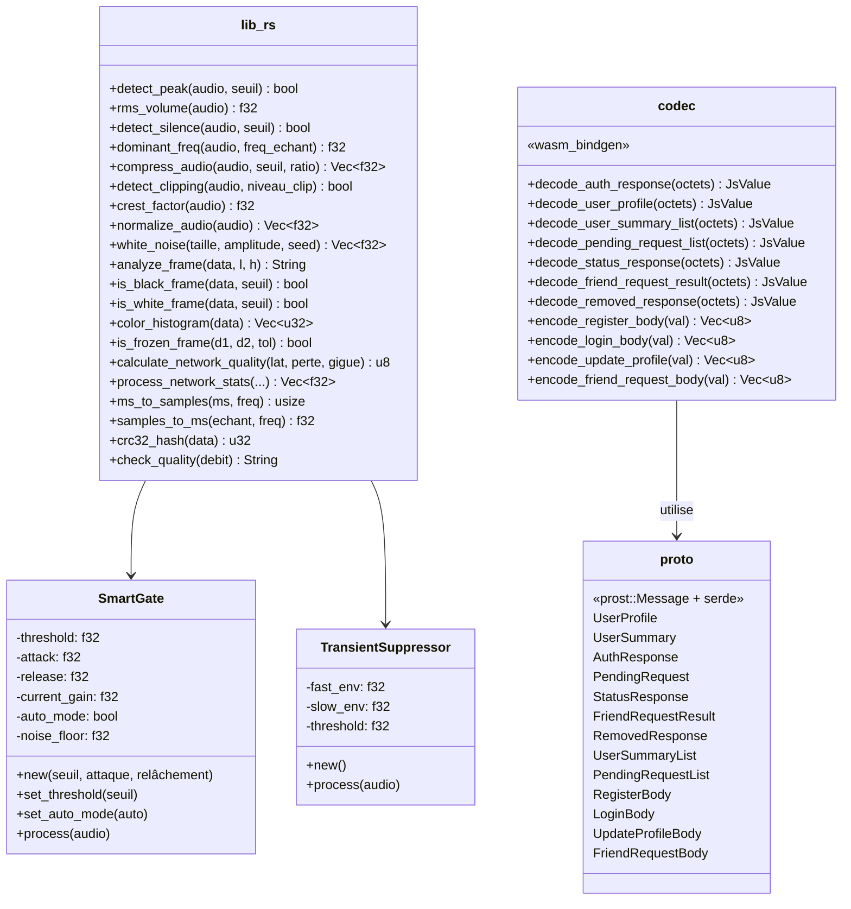

---

## Codec Protobuf — Flux de négociation de contenu

Le module codec remplace la sérialisation JSON par du protobuf binaire pour toutes les communications API HTTP.  
Les numéros de tag sont synchronisés avec `packages/signaling-server/src/models.rs`.

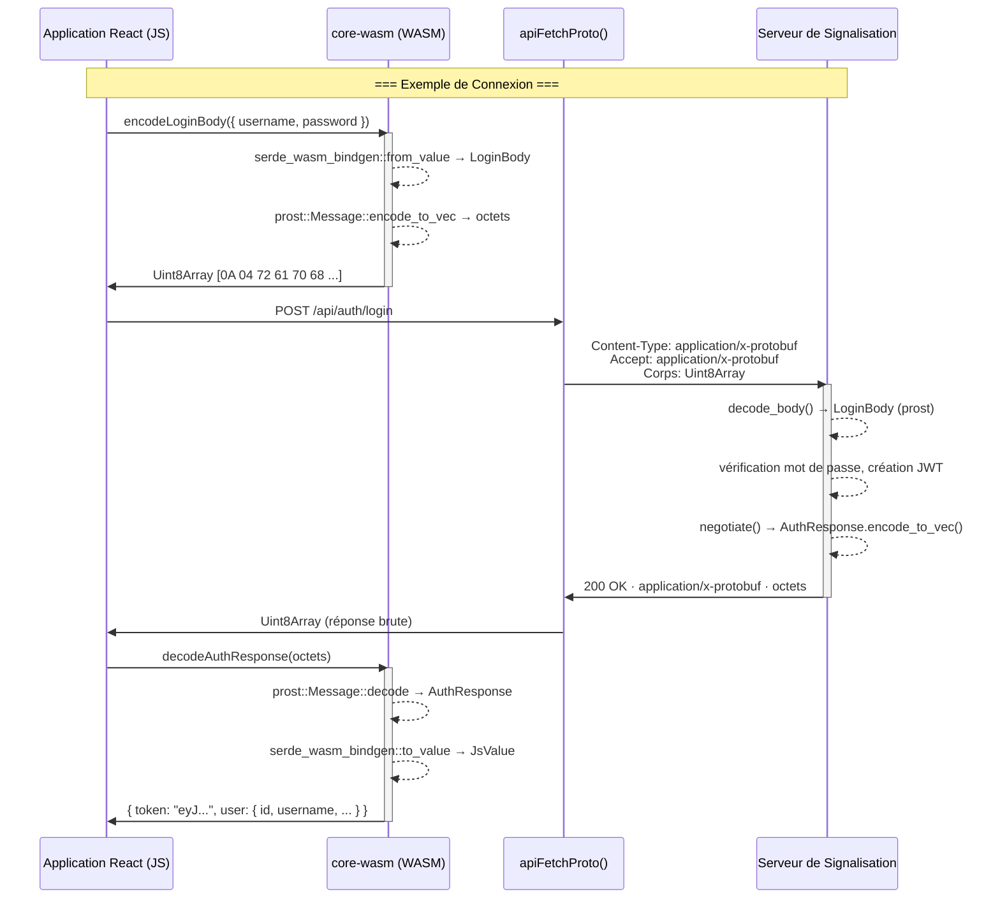

### Rétrocompatibilité

Le serveur effectue une **négociation de contenu** : si le header `Accept` ne contient pas `application/x-protobuf`, les réponses reviennent au JSON classique. Cela garantit que `curl`, les outils de développement du navigateur et les clients existants continuent de fonctionner.

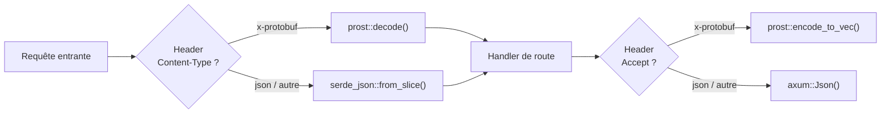

---

## Schéma Protobuf (prost derive — pas de fichier `.proto`)

Tous les types utilisent les macros de dérivation `prost::Message`. Les numéros de tag définissent le format sur le fil.

| Message | Tag 1 | Tag 2 | Tag 3 | Tag 4 | Tag 5 | Tag 6 |
|---|---|---|---|---|---|---|
| **UserProfile** | `id` string | `username` string | `display_name` string | `avatar` string? | `public_key` string? | `created_at_ms` int64 |
| **UserSummary** | `id` string | `username` string | `display_name` string | `avatar` string? | — | — |
| **AuthResponse** | `token` string | `user` UserProfile? | — | — | — | — |
| **PendingRequest** | `id` string | `from` UserSummary? | `created_at_ms` int64 | — | — | — |
| **RegisterBody** | `username` string | `password` string | `display_name` string | `public_key` string? | — | — |
| **LoginBody** | `username` string | `password` string | — | — | — | — |
| **UpdateProfileBody** | `display_name` string? | `avatar` string? | — | — | — | — |
| **FriendRequestBody** | `to_user_id` string | — | — | — | — | — |
| **StatusResponse** | `status` string | — | — | — | — | — |
| **FriendRequestResult** | `id` string | `status` string | — | — | — | — |
| **RemovedResponse** | `removed` bool | — | — | — | — | — |
| **UserSummaryList** | `items` UserSummary[] | — | — | — | — | — |
| **PendingRequestList** | `items` PendingRequest[] | — | — | — | — | — |

> **Critique :** les numéros de tag DOIVENT rester synchronisés entre `core-wasm/src/proto.rs` et `signaling-server/src/models.rs`.

---

## Pipeline DSP — Traitement Audio

`SmartGate` et `TransientSuppressor` s'exécutent dans un `AudioWorkletProcessor`, appelé par blocs de 128 échantillons à 48 kHz.

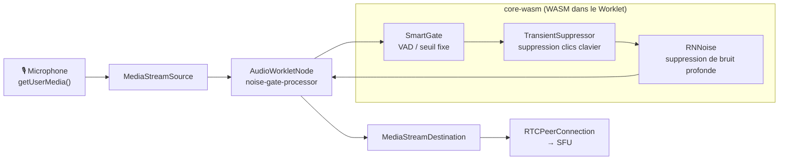

### Algorithme SmartGate

```
si auto_mode:
    plancher_bruit += (rms - plancher_bruit) × 0.0001   # adaptation lente
    ouvert = rms > max(plancher_bruit × 4, 0.005)
sinon:
    ouvert = rms > seuil

gain → lissage attaque/relâchement par échantillon
sortie = entrée × gain
```

### Algorithme TransientSuppressor

```
enveloppe_rapide = env_rapide × 0.9  + |échantillon| × 0.1    # ~1ms  @48kHz
enveloppe_lente  = env_lente  × 0.999 + |échantillon| × 0.001  # ~20ms @48kHz

si enveloppe_rapide > enveloppe_lente × 4.0:
    gain = (lente × 4 / rapide) ^ 1.5                          # réduction douce
    échantillon *= gain
```

---

## Scoring de Qualité Réseau

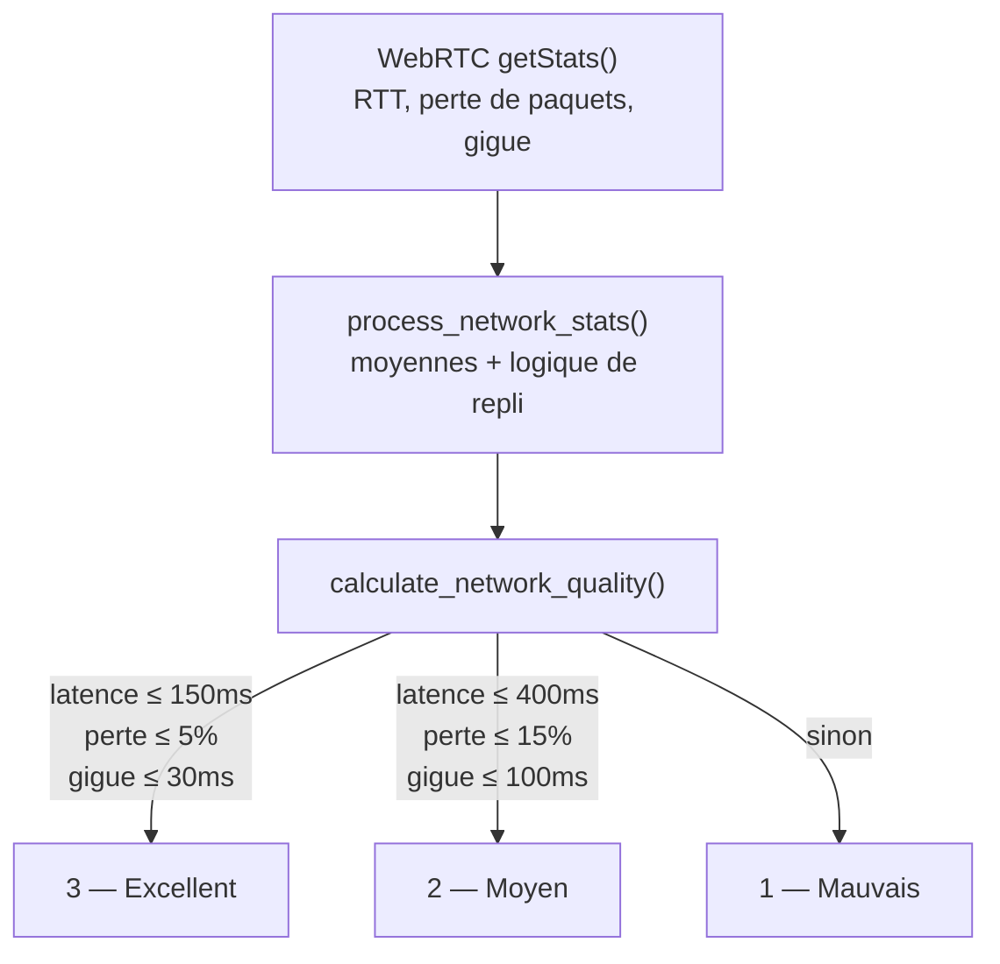

Retourne `[ping, pertePaquets%, gigue, qualité, rttBrut]` sous forme de `Float32Array`.

---

## Compilation & Intégration

### Prérequis

- Toolchain Rust avec la cible `wasm32-unknown-unknown`
- [`wasm-pack`](https://rustwasm.github.io/wasm-pack/) ≥ 0.13

### Compiler

```bash
# Depuis la racine du monorepo (ou via pnpm wasm:build depuis apps/desktop)
cd packages/core-wasm
wasm-pack build --target web --out-dir ../../apps/desktop/src/pkg
```

Le résultat atterrit dans `apps/desktop/src/pkg/` :

| Fichier | Rôle |
|---|---|
| `core_wasm.js` | Glue JS (ESM, `init()` + exports de fonctions) |
| `core_wasm.d.ts` | Déclarations TypeScript |
| `core_wasm_bg.wasm` | Binaire WASM compilé |

### Utilisation Frontend

```typescript
// Initialisation singleton (un seul appel suffit, idempotent)
import { ensureWasm, decodeUserProfile, encodeLoginBody } from './lib/wasm-codec';

await ensureWasm();

// Encoder un corps de requête → Uint8Array
const bytes = encodeLoginBody({ username: "raph", password: "1234" });

// Décoder une réponse protobuf → objet JS typé
const profile = decodeUserProfile(octetsReponse) as UserProfile;
```

### Utilisation AudioWorklet

```javascript
// À l'intérieur du processeur worklet
const wasmBuffer = event.data.wasmBuffer;
await initWasm(wasmBuffer);

const gate = new SmartGate(0.01, 0.01, 0.1);
gate.set_auto_mode(true);

const suppressor = new TransientSuppressor();

// Par bloc audio (128 échantillons @ 48kHz)
gate.process(audioBuffer);
suppressor.process(audioBuffer);
```

---

## Dépendances

| Crate | Version | Rôle |
|---|---|---|
| `wasm-bindgen` | 0.2 | Pont JS ↔ WASM |
| `prost` | 0.13 | Encodage/décodage protobuf (pas de `.proto` nécessaire) |
| `serde` | 1.0 | Framework de sérialisation |
| `serde-wasm-bindgen` | 0.6 | Conversion `JsValue` ↔ struct Rust |
| `crc32fast` | 1.5 | Checksums CRC32 rapides |

---

## Structure des fichiers

```
packages/core-wasm/
├── Cargo.toml
├── README.md
├── benches/
│   └── dsp.rs           # Benchmarks Criterion (cible native, --features bench)
├── tests/
└── src/
    ├── lib.rs          # Fonctions DSP, vidéo, réseau + SmartGate + TransientSuppressor
    ├── proto.rs         # Types protobuf (prost derive, synchronisés avec le serveur)
    └── codec.rs         # Fonctions encode/decode exposées via wasm_bindgen
```

---

## Benchmarks (criterion)

Le crate embarque une suite [`criterion`](https://github.com/bheisler/criterion.rs)
qui profile les chemins critiques DSP sur la cible **native** (criterion ne peut
pas tourner sous wasm32). Les benches reproduisent les tailles de frames
réalistes utilisées par l'`AudioWorkletProcessor` (10 ms / 20 ms @ 48 kHz) et
le worker d'analyse (frames RGBA 320×180).

### Lancement

```bash
cargo bench -p core-wasm --features bench
```

> La feature `bench` expose `__bench_compute_seal()` afin que criterion puisse
> activer le runtime context et exercer le *vrai* hot path de
> `SmartGate::process` / `TransientSuppressor::process` plutôt que le chemin
> dégradé de fallback. Cette feature **ne doit jamais** être activée en
> production ni dans les builds wasm.

### Couverture

| Groupe | Benchmarks |
|---|---|
| `audio_analysis` | `detect_peak`, `rms_volume`, `detect_silence`, `detect_clipping`, `crest_factor`, `dominant_freq` (480 / 960 / 4096 échantillons) |
| `audio_fx` | `compress_audio`, `normalize_audio`, `white_noise_960` |
| `processors` | `smart_gate_manual`, `smart_gate_auto`, `transient_suppressor` |
| `hash_and_video` | `crc32_hash_4k`, `compute_fingerprint`, `color_histogram_320x180`, `is_frozen_frame_320x180` |

### Résultats indicatifs (x86_64 natif, release)

| Hot path | Frame | Médiane | Throughput |
|---|---|---|---|
| `detect_peak` | 480 | 4.15 ns | ~114 Gelem/s |
| `rms_volume` | 480 | 380 ns | ~1.26 Gelem/s |
| `compress_audio` | 960 | 3.77 µs | ~255 Melem/s |
| `SmartGate.process` (auto) | 960 | 2.08 µs | ~460 Melem/s |
| `TransientSuppressor.process` | 960 | 2.50 µs | ~384 Melem/s |
| `crc32_hash` | 4 KiB | 2.69 µs | ~1.41 GiB/s |
| `color_histogram` | 320×180 | 92.8 µs | ~2.31 GiB/s |

Ces chiffres ne sont que des points de référence — le débit réel sous wasm32
dans le worklet sera différent ; les runs criterion sont à utiliser comme
**détecteurs de régression**, pas comme valeurs SLA absolues.

> Note : un vrai bug d'out-of-bounds dans `dominant_freq` a été détecté lors
> de la mise en place du suite de benchmarks (le `max_lag` de l'autocorrélation
> n'était pas borné par la longueur du buffer, ce qui causait un panic sur les
> frames WebRTC de 10 ms). Le correctif est dans `lib.rs` — voir l'historique
> de commits.

---

