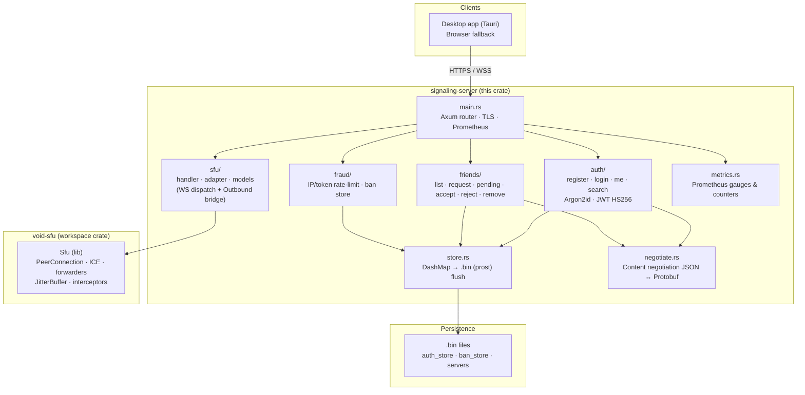
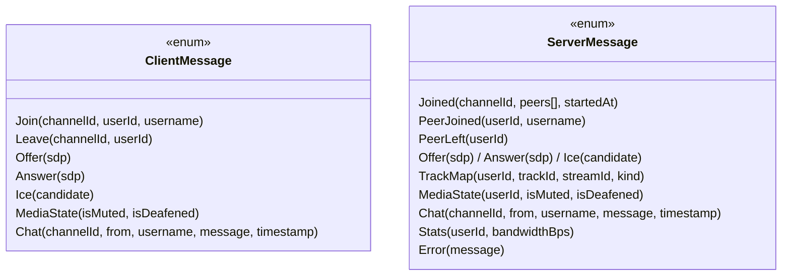
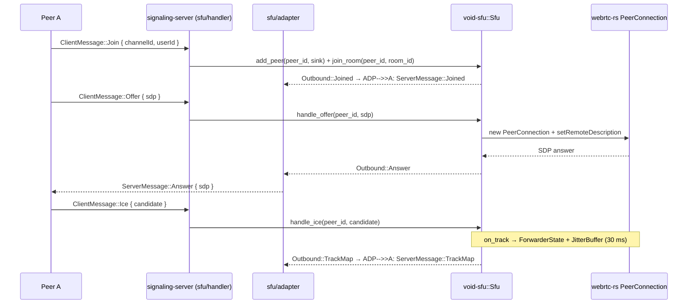

# Void — Signaling Server

High-performance signaling server for the Void platform. Hosts the **REST surface** (auth, friends, presence), the **WebSocket signaling channel**, and embeds the [`void-sfu`](../void-sfu) crate as its media plane. Written in **Rust** with **Axum**, **Tokio**, and **rustls**.

> **License:** Business Source License 1.1 (BSL-1.1) — see the repository [`LICENSE`](../../LICENSE).

---

## Why this binary exists

`signaling-server` is the **only** server-side component clients ever talk to. It owns three concerns:

1. **REST surface** (`/api/auth`, `/health`, `/metrics`, plus a legacy `/api/friends` kept for backwards compatibility) — account lifecycle, observability, tooling interop.
2. **WebSocket signaling + RPC** — peer discovery, media-state fan-out, real-time chat, **the canonical friends API (`friends.*` RPC + server-pushed events)**, presence updates.
3. **Media-plane orchestration** — adapts WebSocket frames to the `void-sfu` crate (which does the actual SDP/ICE/RTP work).

Splitting the SFU into its own library (`packages/void-sfu`) lets us:

- swap the media plane in tests without spinning up a full HTTP+TLS stack,
- evolve the WebRTC stack independently of the auth/friends/REST surface,
- prepare for future "media-only" deployments behind a load balancer.

---

## Architecture



### Module map

| Path | Role |
|---|---|
| `src/main.rs` | Axum router, TLS bootstrap, Prometheus exporter, graceful shutdown. |
| `src/auth/` | Registration / login / `me` / user search. Argon2id hashing, JWT (HS256, 7-day expiry), Bearer middleware. |
| `src/friends/` | Friend graph CRUD: send / accept / reject / remove + pending listing. |
| `src/fraud/` | IP guard, fraud detector, ban store, fingerprint counters. |
| `src/sfu/` | Adapts WebSocket frames to `void-sfu`: `handler.rs` dispatches messages, `adapter.rs` translates `Outbound`/`RoomEvent` into the WS protocol, `registry.rs` tracks application-level servers. |
| `src/store.rs` | In-memory `DashMap` store with **prost** binary serialization (`.bin` files), debounced background flush. |
| `src/metrics.rs` | Prometheus exposition (`/metrics`): active peers, channels, ingress/egress bandwidth, packets per second. |
| `src/negotiate.rs` | Per-request `Content-Type`/`Accept` negotiation between JSON and `application/x-protobuf`. |
| `src/errors.rs` | `ApiError` enum mapped to HTTP status codes. |
| `src/nonce.rs` | Replay-protection for signed payloads. |
| `src/diagram/` | Live system diagram payload exposed for the desktop debug tools. |

---

## Features

| Feature | Description |
|---|---|
| **REST API** | Account, profile, friends, presence; protobuf or JSON depending on `Accept` header. |
| **WebSocket signaling** | Single multiplexed socket per client: SFU control, chat, friends notifications, presence updates. |
| **Server-side SFU** | Delegated to `void-sfu` (PeerConnection lifecycle, ICE, forwarders, JitterBuffer 30 ms). |
| **Auth** | Argon2id password hashing + JWT HS256 (7-day expiry), Bearer middleware, replay-protected critical mutations. |
| **Friends graph** | WS-RPC (`friends.*` methods) + server-pushed `FriendRequestReceived` / `FriendRequestAccepted` / `FriendRemoved` events. UI converges in real time, no polling. Legacy REST routes are kept for backwards compat only. |
| **Fraud / rate-limiting** | Per-IP and per-token windowed counters, persisted ban store. |
| **Content negotiation** | Automatic JSON ↔ Protobuf selection per request, no breaking change for non-protobuf clients. |
| **Persistence** | DashMap snapshots flushed to `.bin` (prost) — boot time stays in single-digit ms even with thousands of users. |
| **Observability** | Prometheus exporter, `/health` probe, structured `tracing` logs. |
| **TLS** | Production: rustls with cert/key PEM files. Development: `DEV_MODE=1` runs HTTP only. |

---

## WebSocket protocol



### SFU flow (delegated to `void-sfu`)



---

## REST API

### Auth (`/api/auth/`)

| Method | Endpoint | Auth | Description |
|---|---|---|---|
| POST | `/register` | — | Create account (`username`, `password`, `display_name`). |
| POST | `/login` | — | Returns JWT + `UserProfile`. |
| GET | `/me` | Bearer | Current user profile. |
| PUT | `/me` | Bearer | Update `display_name` / `avatar`. |
| GET | `/search?q=` | Bearer | Search users by username. |

### Friends — **WS-RPC** (canonical, push-driven)

Friends are **not** consumed via REST anymore. The desktop client opens a single authenticated WebSocket and uses the **`RpcCall` / `RpcResult` envelope** for every read/write, so the user sees invitations and acceptances **instantly without ever polling or refreshing**.

| Method | Params | Returns | Description |
|---|---|---|---|
| `friends.list` | — | `UserSummary[]` | Accepted friends. |
| `friends.pending` | — | `PendingRequest[]` | Inbound pending requests. |
| `friends.send` | `{ toUserId }` | `FriendRequestResult` | Send a friend request. |
| `friends.accept` | `{ id }` | `{ status: "accepted" }` | Accept a pending request. |
| `friends.reject` | `{ id }` | `{ status: "rejected" }` | Reject a pending request. |
| `friends.remove` | `{ id }` | `{ removed }` | Remove a friendship by id. |
| `friends.removeByUser` | `{ userId }` | `{ removed }` | Remove a friendship by counterpart user id. |

Every call goes through `src/sfu/rpc.rs` and reuses the `friends/core.rs` business logic verbatim — no duplication between transports.

### Server-pushed friend events

The server **proactively notifies** the impacted user(s) over the same WS so their UI converges in real time. No polling, no manual refresh.

| Event (server → client) | Recipient | Trigger |
|---|---|---|
| `FriendRequestReceived { request }` | Target user | A new request was sent to them. |
| `FriendRequestAccepted { request_id, friend }` | Original sender | Their request was accepted. |
| `FriendRemoved { friendship_id, by_user_id }` | The other party | A friendship was deleted. |

The frontend bus (`subscribeSignalingEvent`, see `src/lib/signalingBus.ts`) hands these events to `useFriendsRealtime` which mutates the `FriendsContext` state without any HTTP round-trip.

### REST `/api/friends/` (legacy)

The legacy REST routes still exist for tooling/curl interop and for clients that have not migrated yet:

| Method | Endpoint | Auth | Description |
|---|---|---|---|
| GET | `/api/friends/` | Bearer | List all friends. |
| POST | `/api/friends/request` | Bearer | Send a friend request. |
| GET | `/api/friends/pending` | Bearer | List pending requests. |
| POST | `/api/friends/:id/accept` | Bearer | Accept a friend request. |
| POST | `/api/friends/:id/reject` | Bearer | Reject a friend request. |
| DELETE | `/api/friends/:id` | Bearer | Remove a friendship. |
| DELETE | `/api/friends/by-user/:user_id` | Bearer | Remove a friendship by user id. |

> ⚠️ **REST is response-only.** It does **not** push notifications back. New code must use the WS-RPC surface; the REST routes are kept solely for backwards compatibility and may be removed once no external tooling depends on them.

---

## Configuration

```bash
# .env
RUST_LOG=info       # Log level: trace | debug | info | warn | error
DEV_MODE=1          # Optional: HTTP-only dev server (no TLS)
PORT=3001           # Optional: HTTP/WS listen port
```

| Port | Protocol | Description |
|---|---|---|
| `3001` | TCP | HTTPS/WSS (signaling + REST). |
| `10000–20000` | UDP | WebRTC RTP/RTCP media (delegated to `void-sfu`). |

### TLS certificates

```bash
openssl req -x509 -newkey rsa:4096 -keyout key.pem -out cert.pem \
  -sha256 -days 365 -nodes -subj "/C=FR/ST=PACA/L=LaGarde/O=Void/CN=<public_ip>"
```

---

## Build & run

```bash
# Development (HTTP, no TLS)
DEV_MODE=1 cargo run -p signaling-server

# Production (TLS required)
cargo build --release -p signaling-server
./target/release/signaling-server

# Cross-compile to ARM64 Linux
cargo build --release --target aarch64-unknown-linux-gnu -p signaling-server
```

### Docker

```bash
docker compose up -d --build
docker compose logs -f signaling-server
```

---

## Prometheus metrics

| Metric | Type | Description |
|---|---|---|
| `sfu_active_peers` | Gauge | Currently connected peers. |
| `sfu_active_channels` | Gauge | Active channels. |
| `sfu_bandwidth_egress_bps` | Gauge | Outbound media bandwidth. |
| `sfu_bandwidth_ingress_bps` | Gauge | Inbound media bandwidth. |
| `sfu_packets_per_second` | Histogram | RTP packets per second. |
| `auth_invalid_tokens_total` | Counter | Bearer tokens rejected by the middleware. |
| `fraud_blocked_requests_total` | Counter | Requests blocked by the fraud detector. |

Endpoints: `GET /metrics`, `GET /health`.

---

## Testing

```bash
cargo test -p signaling-server                     # all tests
cargo test -p signaling-server -- crypto_tests     # focused module
```

Tests live under `src/tests/` (one file per logical concern: `auth`, `jwt`, `password`, `fraud`, `negotiate`, `nonce`, `registry`, `state`, `sfu_models`, …).

---

## API documentation

```bash
cargo doc -p signaling-server --no-deps --open
```

Output: `target/doc/signaling_server/index.html`.

---

## Dependencies

| Crate | Role |
|---|---|
| `axum` | HTTP/WebSocket framework. |
| `tokio` | Async runtime. |
| `void-sfu` (workspace) | Media plane (PeerConnection, ICE, RTP forwarders). |
| `prost` | Protobuf encode/decode for the binary wire format. |
| `dashmap` | Concurrent in-memory store. |
| `argon2` | Password hashing. |
| `jsonwebtoken` | JWT HS256 sign/verify. |
| `prometheus` | Metrics exposition. |
| `rustls` / `axum-server` | TLS termination. |
| `tracing` | Structured logs. |

---

## Security

| Layer | Protection |
|---|---|
| **Transport** | TLS 1.3 (rustls). |
| **Media** | DTLS/SRTP enforced by `void-sfu` for every WebRTC track. |
| **Auth** | Argon2id password hashing, JWT Bearer with 7-day expiry, replay-protected critical mutations (nonce). |
| **Rate-limit** | Per-IP and per-token sliding windows; persistent ban store with recidivism tracking. |
| **Memory** | Rust memory safety + zero `unsafe` in `void-sfu` — no buffer overflows, no panics on network input. |

---

## Benchmarks (criterion)

The crate ships a [`criterion`](https://github.com/bheisler/criterion.rs) suite that targets every CPU-bound hot path of the daemon **without** the HTTP/WS layer. The crate is built as both a library (`signaling_server`) and a binary so benches and integration tests can import internal modules directly.

### Run

```bash
cargo bench -p signaling-server
# or one group at a time:
cargo bench -p signaling-server --bench auth
cargo bench -p signaling-server --bench codec
cargo bench -p signaling-server --bench prost_store
cargo bench -p signaling-server --bench fraud
```

### Coverage

| Group | Benchmarks |
|---|---|
| `auth` | `argon2_hash_password`, `argon2_verify_password_{ok,ko}`, `jwt_create_token`, `jwt_decode_token`, `ed25519_verify_signature_{32B,256B}` |
| `codec` | `proto_{encode,decode}_login_body`, `proto_{encode,decode}_auth_response`, `proto_{encode,decode}_user_summary_list` (10 / 100 / 1 000), `proto_{encode,decode}_pending_request_list` (10 / 100), `negotiate_decode_body_{proto,json}`, `serialize_server_message_chat_json` |
| `prost_store` | `store_snapshot_{encode,decode}` (100 / 1 000 / 10 000 users), `ban_snapshot_{encode,decode}` (100 / 10 000 entries), `server_snapshot_{encode,decode}_50x10x200` |
| `fraud` | `ban_store_is_banned_{hit,miss}`, `ban_store_ban_new_ip`, `fraud_detector_record_login_fail`, `nonce_generate_and_consume` |

> **Note on Argon2.** The `argon2_*` group uses `sample_size(10)` because Argon2id is intentionally expensive (~hundreds of ms per call). The other groups keep the criterion default sample size.

### Indicative results (native x86_64, release)

Measured on a developer laptop (Windows / x86_64, Rust 1.x release profile, no
PGO, no LTO beyond defaults). Treat them as **regression detectors**, not as
absolute SLA targets — re-run locally after any change to the hot paths.

#### Auth (`auth` group)

| Hot path | Median | What it means |
|---|---|---|
| `argon2_hash_password` | **≈ 32 ms** | Intentionally expensive (Argon2id default cost). One hash per `/register`. |
| `argon2_verify_password_ok` | **≈ 30 ms** | Same cost as hashing — unavoidable by design. |
| `argon2_verify_password_ko` | **≈ 31 ms** | Constant-time path — same cost as `_ok` (resists timing attacks). |
| `jwt_create_token` | **≈ 1.46 µs** | HMAC-SHA256 sign + base64. ~680 k tokens / s on a single core. |
| `jwt_decode_token` | **≈ 3.16 µs** | Verify + decode. The middleware bottleneck before any DB work. |
| `ed25519_verify_signature_32B` | **≈ 2.91 ms** | Real public-key login path: base64 decode + key parse + verify. |
| `ed25519_verify_signature_256B` | **≈ 2.85 ms** | Verify cost is essentially constant for typical message sizes. |

> **Why Argon2 dominates.** A single Argon2id hash takes ~30 ms by design —
> it is the password-hashing line of defense. With 8 server cores you can
> sustain ~250 logins / s before saturation; this is **the** capacity ceiling
> of the register/login routes.
>
> **Plain-language take.** 30 ms is shorter than a human eye blink (~100 ms).
> The point is **not** to be fast: it's to make a stolen password database
> useless to attackers — at this cost they can brute-force only ~33 guesses
> per second per core, vs. billions per second on a plain SHA-256 dump.
> Ed25519 verify costs ~3 ms here because each call re-decodes the public key
> and parses the PKCS#8 envelope; that's the realistic per-login overhead a
> passwordless flow pays — still **300 logins / s per core**, well above any
> reasonable signup rate.

#### Wire codec (`codec` group)

Encode/decode of the protobuf bodies exchanged with the desktop client.

| Hot path | Median | Throughput |
|---|---|---|
| `proto_encode_login_body` | **≈ 97 ns** | 1.83 GiB/s |
| `proto_decode_login_body` | **≈ 220 ns** | 855 MiB/s |
| `proto_encode_auth_response` | **≈ 257 ns** | 1.08 GiB/s |
| `proto_decode_auth_response` | **≈ 577 ns** | 581 MiB/s |
| `proto_encode_user_summary_list/10` | **≈ 1.69 µs** | 1.03 GiB/s |
| `proto_encode_user_summary_list/100` | **≈ 15.5 µs** | 1.05 GiB/s |
| `proto_encode_user_summary_list/1000` | **≈ 144 µs** | 1.07 GiB/s |
| `proto_decode_user_summary_list/1000` | **≈ 443 µs** | 380 MiB/s |
| `proto_encode_pending_request_list/100` | **≈ 25 µs** | 718 MiB/s |
| `proto_decode_pending_request_list/100` | **≈ 63 µs** | 296 MiB/s |
| `negotiate_decode_body_proto` | **≈ 302 ns** | — |
| `negotiate_decode_body_json` | **≈ 494 ns** | — |
| `serialize_server_message_chat_json` | **≈ 454 ns** | — |

> **Reading the comparison.** `negotiate_decode_body_proto` is **≈ 1.6× faster
> than its JSON counterpart** for the same `LoginBody` payload (302 ns vs
> 494 ns). The advantage grows on lists: protobuf decoding scales linearly
> with the number of items while JSON re-pays the parser overhead per element.
>
> **Plain-language take.** Encoding a login body in protobuf takes ~100 ns,
> i.e. **10 million logins / second per core** before the wire format becomes
> a bottleneck. Even encoding a full directory of 1 000 users (`UserSummaryList`)
> only costs 144 µs — fast enough to render that list every frame at 60 fps
> and still have 99.1 % of the frame budget left for everything else.

#### Persistence (`prost_store` group)

| Hot path | Median |
|---|---|
| `store_snapshot_encode/100` | **≈ 27 µs** |
| `store_snapshot_decode/100` | **≈ 60 µs** |
| `store_snapshot_encode/1 000` | **≈ 259 µs** |
| `store_snapshot_decode/1 000` | **≈ 599 µs** |
| `store_snapshot_encode/10 000` | **≈ 3.01 ms** |
| `store_snapshot_decode/10 000` | **≈ 7.39 ms** |
| `ban_snapshot_encode/100` | **≈ 20 µs** |
| `ban_snapshot_decode/100` | **≈ 33 µs** |
| `ban_snapshot_encode/10 000` | **≈ 2.10 ms** |
| `ban_snapshot_decode/10 000` | **≈ 3.29 ms** |
| `server_snapshot_encode_50x10x200` | **≈ 317 µs** |
| `server_snapshot_decode_50x10x200` | **≈ 1.18 ms** |

> **Boot-time impact.** Decoding 10 000 user records takes ~7 ms — even with a
> 100 k-user dataset the cold start stays well below 100 ms.
>
> **Plain-language take.** When the daemon (re)starts, it has to read the
> whole user database into memory before serving traffic. With 10 000 users
> that takes 7 ms — a fraction of an eye blink. Even at 100 000 users
> (Discord-sized small community) the cold start would still finish under
> 100 ms, well under the time it takes a load-balancer to flip a node from
> "draining" to "active". Saving the database back to disk is twice as fast
> (3 ms for 10 000 users) and runs on a debounced background flush, so it
> never stalls a request.

#### Fraud / rate-limit (`fraud` group)

| Hot path | Median |
|---|---|
| `ban_store_is_banned_hit` | **≈ 83 ns** |
| `ban_store_is_banned_miss` | **≈ 39 ns** |
| `ban_store_ban_new_ip` | **≈ 3.54 µs** |
| `fraud_detector_record_login_fail` | **≈ 1.59 µs** |
| `nonce_generate_and_consume` | **≈ 1.15 µs** |

> The IP-guard middleware checks `is_banned` on every request — at 39 ns / miss
> it adds **less than 1 / 25 000 of a millisecond** to a healthy request.
>
> **Plain-language take.** Imagine a club bouncer checking IDs at the door.
> Our bouncer takes 39 nanoseconds per check — that's **25 million honest
> visitors waved through every second per core**. Even a banned IP is rejected
> in 83 ns. Recording a brand-new ban (writing it to the in-memory store +
> notifying the disk flusher) costs 3.5 µs, still ~286 000 bans per second per
> core: a DDoS attempt fills the ban list far slower than we can grow it.

### Units glossary

The criterion harness reports two families of numbers: **time per call** and
**throughput**. They're tiny because the benches measure CPU work *only* —
no syscalls, no I/O.

#### Time units

| Unit | Symbol | Value | Mental model |
|---|---|---|---|
| Nanosecond | `ns` | 10⁻⁹ s = 0.000 000 001 s | A few CPU cycles. ~1 ns per cycle on a 1 GHz core, ~0.3 ns on a 3 GHz core. |
| Microsecond | `µs` | 10⁻⁶ s = 1 000 ns | Roughly the cost of a syscall round-trip on Linux. |
| Millisecond | `ms` | 10⁻³ s = 1 000 µs = 1 000 000 ns | Human-visible: 16 ms is one 60 fps frame; 30 ms is the SFU jitter window. |

> **Quick ladder.** 1 s → 1 000 ms → 1 000 000 µs → 1 000 000 000 ns.
> A bench at 100 ns can run **10 million times per second on a single core**.

#### Throughput units

Criterion derives throughput from `Throughput::Bytes(n)` or
`Throughput::Elements(n)` declared in the bench. Two flavors:

| Unit | Symbol | Meaning |
|---|---|---|
| Bytes per second (binary) | `KiB/s`, `MiB/s`, `GiB/s` | **Mebibyte = 2²⁰ = 1 048 576 bytes**, gibibyte = 2³⁰ bytes. Criterion **always** uses the binary prefixes (so `MiB/s` ≠ `MB/s` from networking specs by ~5 %). |
| Elements per second | `Kelem/s`, `Melem/s`, `Gelem/s` | **Melem/s = 10⁶ items / s.** "Item" is whatever the bench declared (a packet, a sample, a `ForwardingStats::update` call …). |

#### How to read a criterion line

```
codec/proto_encode_user_summary_list/100
                        time:   [14.43 µs 15.52 µs 16.67 µs]
                        thrpt:  [1.03 GiB/s 1.05 GiB/s 1.07 GiB/s]
```

- **`time:`** lower / median / upper bound of a 95 % confidence interval over
  the sampled iterations. Use the **middle** value as the reference.
- **`thrpt:`** the same span, but expressed as `Throughput::Bytes` divided
  by time. Higher is better.

> **Tip.** A regression that moves the median by more than ~5 % across runs
> on the same machine is worth investigating; under that, attribute it to
> warm-up noise / OS scheduling.

> A `lib.rs` was added so criterion (and any future tooling) can import the modules (`auth`, `store`, `fraud`, `nonce`, `models`, `negotiate`, `sfu`, `friends`, `metrics`). The daemon binary still lives in `src/main.rs` and depends on the library via `signaling_server::*`.

---

# Void — Serveur de Signalisation (FR)

Serveur de signalisation haute performance pour la plateforme Void. Héberge la **surface REST** (auth, amis, présence), le **canal WebSocket de signalisation**, et embarque le crate [`void-sfu`](../void-sfu) comme plan média. Écrit en **Rust** avec **Axum**, **Tokio** et **rustls**.

> **Licence :** Business Source License 1.1 (BSL-1.1) — voir [`LICENSE`](../../LICENSE) à la racine du dépôt.

---

## Pourquoi ce binaire existe

`signaling-server` est le **seul** composant côté serveur que les clients contactent. Il s'occupe de trois choses :

1. **Surface REST** (`/api/auth`, `/health`, `/metrics`, plus une route héritée `/api/friends` conservée pour rétrocompatibilité) — cycle de vie des comptes, observabilité, interop outillage.
2. **Signalisation WebSocket + RPC** — découverte des pairs, fan-out d'état média, chat temps réel, **API amis canonique (`friends.*` RPC + événements poussés par le serveur)**, mises à jour de présence.
3. **Orchestration du plan média** — adapte les trames WebSocket au crate `void-sfu` (qui réalise concrètement le travail SDP/ICE/RTP).

Avoir extrait la SFU dans son propre crate (`packages/void-sfu`) permet de :

- remplacer le plan média dans les tests sans monter une stack HTTP+TLS complète,
- faire évoluer la stack WebRTC indépendamment de la surface auth/amis/REST,
- préparer un futur déploiement "média seul" derrière un load balancer.

---

## Architecture

(voir le diagramme Mermaid en section anglaise — la structure est identique.)

### Carte des modules

| Chemin | Rôle |
|---|---|
| `src/main.rs` | Routeur Axum, bootstrap TLS, exporter Prometheus, arrêt gracieux. |
| `src/auth/` | Inscription / connexion / `me` / recherche d'utilisateurs. Argon2id, JWT (HS256, expiration 7 jours), middleware Bearer. |
| `src/friends/` | CRUD du graphe d'amis : envoyer / accepter / rejeter / supprimer + listing en attente. |
| `src/fraud/` | Garde IP, détecteur de fraude, ban store, compteurs de fingerprint. |
| `src/sfu/` | Adapte les trames WebSocket à `void-sfu` : `handler.rs` distribue les messages, `adapter.rs` traduit `Outbound`/`RoomEvent` vers le protocole WS, `registry.rs` suit les serveurs applicatifs. |
| `src/store.rs` | Store mémoire `DashMap` avec sérialisation binaire **prost** (fichiers `.bin`) et flush asynchrone debouncé. |
| `src/metrics.rs` | Exposition Prometheus (`/metrics`) : pairs actifs, canaux, bande passante in/out, paquets/s. |
| `src/negotiate.rs` | Négociation `Content-Type`/`Accept` entre JSON et `application/x-protobuf` à chaque requête. |
| `src/errors.rs` | Enum `ApiError` mappé vers les codes HTTP. |
| `src/nonce.rs` | Protection contre le rejeu pour les payloads signés. |
| `src/diagram/` | Payload de diagramme système exposé pour les outils de debug du desktop. |

---

## Fonctionnalités

| Fonctionnalité | Description |
|---|---|
| **API REST** | Comptes, profil, amis, présence ; protobuf ou JSON selon le header `Accept`. |
| **Signalisation WebSocket** | Une seule socket multiplexée par client : contrôle SFU, chat, notifications amis, présence. |
| **SFU côté serveur** | Délégué à `void-sfu` (cycle PeerConnection, ICE, forwarders, JitterBuffer 30 ms). |
| **Auth** | Hachage Argon2id + JWT HS256 (7 jours), middleware Bearer, mutations critiques protégées contre le rejeu. |
| **Graphe d'amis** | WS-RPC (méthodes `friends.*`) + événements `FriendRequestReceived` / `FriendRequestAccepted` / `FriendRemoved` poussés par le serveur. L'UI converge en temps réel, sans polling. Les routes REST historiques ne servent plus qu'à la rétrocompatibilité. |
| **Anti-fraude / rate-limit** | Compteurs glissants par IP et par token, ban store persistant. |
| **Négociation de contenu** | Sélection JSON ↔ Protobuf automatique, sans breaking change pour les clients non-protobuf. |
| **Persistance** | Snapshots DashMap → fichiers `.bin` (prost). Boot en quelques ms même pour des milliers d'utilisateurs. |
| **Observabilité** | Exporter Prometheus, sonde `/health`, logs `tracing` structurés. |
| **TLS** | Production : rustls avec cert/key PEM. Dev : `DEV_MODE=1` lance le serveur en HTTP. |

---

## API REST (FR)

### Auth (`/api/auth/`)

| Méthode | Endpoint | Auth | Description |
|---|---|---|---|
| POST | `/register` | — | Création de compte (`username`, `password`, `display_name`). |
| POST | `/login` | — | Renvoie un JWT + `UserProfile`. |
| GET | `/me` | Bearer | Profil de l'utilisateur courant. |
| PUT | `/me` | Bearer | Mise à jour `display_name` / `avatar`. |
| GET | `/search?q=` | Bearer | Recherche d'utilisateurs. |

### Amis — **WS-RPC** (canonique, push-driven)

Les amis ne passent **plus** par REST côté client. Le desktop ouvre une seule WebSocket authentifiée et utilise l'**enveloppe `RpcCall` / `RpcResult`** pour chaque lecture/écriture : l'utilisateur voit les invitations et acceptations **en temps réel sans aucun polling ni refresh**.

| Méthode | Params | Retour | Description |
|---|---|---|---|
| `friends.list` | — | `UserSummary[]` | Amis acceptés. |
| `friends.pending` | — | `PendingRequest[]` | Demandes entrantes en attente. |
| `friends.send` | `{ toUserId }` | `FriendRequestResult` | Envoyer une demande d'ami. |
| `friends.accept` | `{ id }` | `{ status: "accepted" }` | Accepter une demande. |
| `friends.reject` | `{ id }` | `{ status: "rejected" }` | Rejeter une demande. |
| `friends.remove` | `{ id }` | `{ removed }` | Supprimer une amitié par id. |
| `friends.removeByUser` | `{ userId }` | `{ removed }` | Supprimer une amitié par id d'utilisateur. |

Chaque appel passe par `src/sfu/rpc.rs` et réutilise telle quelle la logique métier de `friends/core.rs` — aucune duplication entre transports.

### Événements amis poussés par le serveur

Le serveur **notifie proactivement** les utilisateurs concernés sur la même WS pour que leur UI converge en temps réel. Aucun polling, aucun rafraîchissement manuel.

| Événement (serveur → client) | Destinataire | Déclencheur |
|---|---|---|
| `FriendRequestReceived { request }` | Utilisateur cible | Une nouvelle demande lui a été envoyée. |
| `FriendRequestAccepted { request_id, friend }` | Émetteur initial | Sa demande a été acceptée. |
| `FriendRemoved { friendship_id, by_user_id }` | L'autre partie | Une amitié a été supprimée. |

Le bus frontend (`subscribeSignalingEvent`, voir `src/lib/signalingBus.ts`) transmet ces événements à `useFriendsRealtime` qui mute l'état du `FriendsContext` sans aucun aller-retour HTTP.

### REST `/api/friends/` (legacy)

Les routes REST historiques existent encore pour l'interop curl/outillage et pour les clients qui n'ont pas migré :

| Méthode | Endpoint | Auth | Description |
|---|---|---|---|
| GET | `/api/friends/` | Bearer | Liste des amis. |
| POST | `/api/friends/request` | Bearer | Envoi d'une demande d'ami. |
| GET | `/api/friends/pending` | Bearer | Demandes en attente. |
| POST | `/api/friends/:id/accept` | Bearer | Accepter une demande. |
| POST | `/api/friends/:id/reject` | Bearer | Rejeter une demande. |
| DELETE | `/api/friends/:id` | Bearer | Supprimer une amitié. |
| DELETE | `/api/friends/by-user/:user_id` | Bearer | Supprimer une amitié par id d'utilisateur. |

> ⚠️ **Le REST est réponse-seule.** Il **ne pousse aucune notification** au client. Tout nouveau code doit passer par le WS-RPC ; les routes REST restent uniquement pour la rétrocompatibilité et seront retirées dès qu'aucun outillage externe n'en dépendra plus.

---

## Compilation & exécution

```bash
# Développement (HTTP, sans TLS)
DEV_MODE=1 cargo run -p signaling-server

# Production (TLS requis)
cargo build --release -p signaling-server
./target/release/signaling-server

# Compilation croisée ARM64 Linux
cargo build --release --target aarch64-unknown-linux-gnu -p signaling-server
```

### Docker

```bash
docker compose up -d --build
docker compose logs -f signaling-server
```

---

## Tests

```bash
cargo test -p signaling-server
cargo test -p signaling-server -- crypto_tests
```

Les tests vivent dans `src/tests/`, un fichier par préoccupation logique (auth, jwt, password, fraud, negotiate, nonce, registry, state, sfu_models, …).

---

## Documentation API

```bash
cargo doc -p signaling-server --no-deps --open
```

Sortie : `target/doc/signaling_server/index.html`.

---

## Sécurité

| Couche | Protection |
|---|---|
| **Transport** | TLS 1.3 (rustls). |
| **Média** | DTLS/SRTP imposé par `void-sfu` pour tous les tracks WebRTC. |
| **Auth** | Hachage Argon2id, JWT Bearer 7 jours, mutations critiques protégées contre le rejeu (nonce). |
| **Rate-limit** | Fenêtres glissantes par IP et par token ; ban store persistant avec récidive. |
| **Mémoire** | Memory safety Rust + zéro `unsafe` dans `void-sfu` — pas de buffer overflow, pas de panic sur entrée réseau. |


---

## Benchmarks (criterion)

Le crate embarque une suite [`criterion`](https://github.com/bheisler/criterion.rs) qui cible chaque chemin critique CPU du daemon **sans passer par la couche HTTP/WS**. Le crate est compilé à la fois comme bibliothèque (`signaling_server`) et comme binaire, afin que les benches et les tests d'intégration puissent importer les modules internes directement.

### Lancement

```bash
cargo bench -p signaling-server
# ou un groupe à la fois :
cargo bench -p signaling-server --bench auth
cargo bench -p signaling-server --bench codec
cargo bench -p signaling-server --bench prost_store
cargo bench -p signaling-server --bench fraud
```

### Couverture

| Groupe | Benchmarks |
|---|---|
| `auth` | `argon2_hash_password`, `argon2_verify_password_{ok,ko}`, `jwt_create_token`, `jwt_decode_token`, `ed25519_verify_signature_{32B,256B}` |
| `codec` | `proto_{encode,decode}_login_body`, `proto_{encode,decode}_auth_response`, `proto_{encode,decode}_user_summary_list` (10 / 100 / 1 000), `proto_{encode,decode}_pending_request_list` (10 / 100), `negotiate_decode_body_{proto,json}`, `serialize_server_message_chat_json` |
| `prost_store` | `store_snapshot_{encode,decode}` (100 / 1 000 / 10 000 utilisateurs), `ban_snapshot_{encode,decode}` (100 / 10 000 entrées), `server_snapshot_{encode,decode}_50x10x200` |
| `fraud` | `ban_store_is_banned_{hit,miss}`, `ban_store_ban_new_ip`, `fraud_detector_record_login_fail`, `nonce_generate_and_consume` |

> **Note sur Argon2.** Le groupe `argon2_*` utilise `sample_size(10)` car Argon2id est volontairement coûteux (~centaines de ms par appel). Les autres groupes conservent la `sample_size` par défaut de criterion.

### Résultats indicatifs (x86_64 natif, release)

Mesures effectuées sur un poste développeur (Windows / x86_64, profil release
Rust 1.x, sans PGO ni LTO au-delà du défaut). À utiliser comme **détecteurs
de régression**, pas comme cibles SLA absolues — relancer localement après
toute modification d'un chemin chaud.

#### Authentification (groupe `auth`)

| Hot path | Médiane | Lecture |
|---|---|---|
| `argon2_hash_password` | **≈ 32 ms** | Volontairement coûteux (paramètres par défaut Argon2id). Un hash par `/register`. |
| `argon2_verify_password_ok` | **≈ 30 ms** | Même coût que le hash — incompressible par construction. |
| `argon2_verify_password_ko` | **≈ 31 ms** | Chemin à temps constant — même coût que `_ok` (résiste aux attaques temporelles). |
| `jwt_create_token` | **≈ 1.46 µs** | Signature HMAC-SHA256 + base64. ~680 k tokens / s sur un cœur. |
| `jwt_decode_token` | **≈ 3.16 µs** | Vérification + décodage. Le goulot du middleware avant tout accès store. |
| `ed25519_verify_signature_32B` | **≈ 2.91 ms** | Vrai chemin de connexion par clé publique : décodage base64 + parsing clé + verify. |
| `ed25519_verify_signature_256B` | **≈ 2.85 ms** | Le coût de vérification est essentiellement constant pour des messages typiques. |

> **Pourquoi Argon2 domine.** Un seul hash Argon2id prend ~30 ms par design —
> c'est la première ligne de défense contre les attaques par dictionnaire.
> Avec 8 cœurs serveur on tient ~250 logins / s avant saturation : c'est **le**
> plafond de capacité des routes register/login.
>
> **Lecture grand public.** 30 ms, c'est plus court qu'un battement de cils
> humain (~100 ms). Le but n'est **pas** d'aller vite : c'est de rendre une
> base de mots de passe volée inutilisable — un attaquant ne peut tester que
> ~33 mots par seconde et par cœur, contre des milliards/s sur un dump
> SHA-256 brut. La vérification Ed25519 coûte ~3 ms ici parce que chaque
> appel re-décode la clé publique et parse l'enveloppe PKCS#8 ; c'est le
> coût réaliste par login d'un flux passwordless — soit quand même
> **300 logins / s par cœur**, largement au-dessus de tout taux d'inscription
> raisonnable.

#### Codec wire (groupe `codec`)

Encodage/décodage des bodies protobuf échangés avec le client desktop.

| Hot path | Médiane | Throughput |
|---|---|---|
| `proto_encode_login_body` | **≈ 97 ns** | 1.83 GiB/s |
| `proto_decode_login_body` | **≈ 220 ns** | 855 MiB/s |
| `proto_encode_auth_response` | **≈ 257 ns** | 1.08 GiB/s |
| `proto_decode_auth_response` | **≈ 577 ns** | 581 MiB/s |
| `proto_encode_user_summary_list/10` | **≈ 1.69 µs** | 1.03 GiB/s |
| `proto_encode_user_summary_list/100` | **≈ 15.5 µs** | 1.05 GiB/s |
| `proto_encode_user_summary_list/1000` | **≈ 144 µs** | 1.07 GiB/s |
| `proto_decode_user_summary_list/1000` | **≈ 443 µs** | 380 MiB/s |
| `proto_encode_pending_request_list/100` | **≈ 25 µs** | 718 MiB/s |
| `proto_decode_pending_request_list/100` | **≈ 63 µs** | 296 MiB/s |
| `negotiate_decode_body_proto` | **≈ 302 ns** | — |
| `negotiate_decode_body_json` | **≈ 494 ns** | — |
| `serialize_server_message_chat_json` | **≈ 454 ns** | — |

> **Lecture comparative.** `negotiate_decode_body_proto` est **≈ 1.6× plus
> rapide** que sa contrepartie JSON pour le même `LoginBody` (302 ns vs
> 494 ns). L'avantage croît sur les listes : le décodage protobuf scale
> linéairement avec le nombre d'items, alors que JSON ré-encaisse l'overhead
> du parser à chaque élément.
>
> **Lecture grand public.** Encoder un body de login en protobuf prend ~100 ns,
> soit **10 millions de logins / seconde par cœur** avant que le format de
> fil devienne un goulot. Même encoder un annuaire complet de 1 000 utilisateurs
> (`UserSummaryList`) ne coûte que 144 µs — assez rapide pour redessiner
> cette liste à chaque frame d'un écran 60 fps en gardant 99,1 % du budget
> de frame disponible pour le reste.

#### Persistance (groupe `prost_store`)

| Hot path | Médiane |
|---|---|
| `store_snapshot_encode/100` | **≈ 27 µs** |
| `store_snapshot_decode/100` | **≈ 60 µs** |
| `store_snapshot_encode/1 000` | **≈ 259 µs** |
| `store_snapshot_decode/1 000` | **≈ 599 µs** |
| `store_snapshot_encode/10 000` | **≈ 3.01 ms** |
| `store_snapshot_decode/10 000` | **≈ 7.39 ms** |
| `ban_snapshot_encode/100` | **≈ 20 µs** |
| `ban_snapshot_decode/100` | **≈ 33 µs** |
| `ban_snapshot_encode/10 000` | **≈ 2.10 ms** |
| `ban_snapshot_decode/10 000` | **≈ 3.29 ms** |
| `server_snapshot_encode_50x10x200` | **≈ 317 µs** |
| `server_snapshot_decode_50x10x200` | **≈ 1.18 ms** |

> **Impact au boot.** Décoder 10 000 enregistrements utilisateur prend ~7 ms —
> même avec 100 k utilisateurs, le cold start reste largement sous 100 ms.
>
> **Lecture grand public.** Quand le daemon (re)démarre, il doit relire toute
> la base utilisateurs en mémoire avant de servir du trafic. Avec 10 000
> utilisateurs ça prend 7 ms — une fraction de battement de cils. Même à
> 100 000 utilisateurs (taille d'une petite communauté Discord), le cold
> start finirait sous 100 ms — moins que le temps qu'il faut à un
> load-balancer pour basculer un nœud de "draining" à "active". L'écriture
> sur disque est deux fois plus rapide (3 ms pour 10 000 utilisateurs) et
> tourne en flush asynchrone debouncé : elle ne bloque jamais une requête.

#### Fraude / rate-limit (groupe `fraud`)

| Hot path | Médiane |
|---|---|
| `ban_store_is_banned_hit` | **≈ 83 ns** |
| `ban_store_is_banned_miss` | **≈ 39 ns** |
| `ban_store_ban_new_ip` | **≈ 3.54 µs** |
| `fraud_detector_record_login_fail` | **≈ 1.59 µs** |
| `nonce_generate_and_consume` | **≈ 1.15 µs** |

> Le middleware IP-guard appelle `is_banned` sur chaque requête : à 39 ns par
> miss, ça ajoute **moins de 1 / 25 000 de milliseconde** à une requête saine.
>
> **Lecture grand public.** Imaginez un videur de boîte de nuit qui contrôle
> les pièces d'identité à l'entrée. Notre videur prend 39 nanosecondes par
> contrôle — soit **25 millions de visiteurs honnêtes laissés passer par
> seconde et par cœur**. Même une IP bannie est rejetée en 83 ns. Enregistrer
> un nouveau bannissement (écriture en mémoire + notification du flusher
> disque) coûte 3,5 µs, soit ~286 000 bans/s par cœur : une tentative DDoS
> remplit la liste de bans bien plus lentement qu'on ne peut la faire grossir.

### Glossaire des unités

Le harness criterion publie deux familles de chiffres : **temps par appel**
et **débit (throughput)**. Les valeurs sont minuscules parce que les benches
ne mesurent *que* du calcul CPU — aucun syscall, aucun I/O.

#### Unités de temps

| Unité | Symbole | Valeur | Repère |
|---|---|---|---|
| Nanoseconde | `ns` | 10⁻⁹ s = 0.000 000 001 s | Quelques cycles CPU. ~1 ns par cycle à 1 GHz, ~0.3 ns à 3 GHz. |
| Microseconde | `µs` | 10⁻⁶ s = 1 000 ns | Environ le coût d'un aller-retour de syscall sous Linux. |
| Milliseconde | `ms` | 10⁻³ s = 1 000 µs = 1 000 000 ns | Visible humainement : 16 ms = une frame à 60 fps ; 30 ms = la fenêtre de gigue de la SFU. |

> **Échelle rapide.** 1 s → 1 000 ms → 1 000 000 µs → 1 000 000 000 ns.
> Un bench à 100 ns peut tourner **10 millions de fois par seconde sur un cœur**.

#### Unités de débit

Criterion dérive le débit depuis `Throughput::Bytes(n)` ou
`Throughput::Elements(n)` déclaré dans le bench. Deux familles :

| Unité | Symbole | Signification |
|---|---|---|
| Octets par seconde (binaire) | `KiB/s`, `MiB/s`, `GiB/s` | **Mebioctet = 2²⁰ = 1 048 576 octets**, gibioctet = 2³⁰ octets. Criterion utilise **toujours** les préfixes binaires (donc `MiB/s` ≠ `MB/s` des specs réseau, ~5 % d'écart). |
| Éléments par seconde | `Kelem/s`, `Melem/s`, `Gelem/s` | **Melem/s = 10⁶ items / s.** L'« item » est ce que le bench a déclaré (un paquet, un échantillon, un appel à `ForwardingStats::update`…). |

#### Comment lire une ligne criterion

```
codec/proto_encode_user_summary_list/100
                        time:   [14.43 µs 15.52 µs 16.67 µs]
                        thrpt:  [1.03 GiB/s 1.05 GiB/s 1.07 GiB/s]
```

- **`time:`** borne basse / médiane / borne haute d'un intervalle de
  confiance à 95 % sur les itérations échantillonnées. Utiliser la valeur
  **du milieu** comme référence.
- **`thrpt:`** le même intervalle exprimé en `Throughput::Bytes` divisé par
  le temps. Plus c'est grand, mieux c'est.

> **Astuce.** Une régression qui déplace la médiane de plus de ~5 % entre
> deux runs sur la même machine mérite enquête ; en-dessous, c'est du bruit
> warm-up / scheduling OS.

> Un `lib.rs` a été ajouté afin que criterion (et tout outillage futur) puisse importer les modules internes (`auth`, `store`, `fraud`, `nonce`, `models`, `negotiate`, `sfu`, `friends`, `metrics`). Le binaire daemon reste dans `src/main.rs` et dépend de la lib via `signaling_server::*`.

