# Void — Spécification du Routing Adaptatif Hybride
> **Version** : 1.2  
> **Date** : 2026-04-08  
> **Statut** : Proposition — À implémenter  
> **Changelog** :  
> — v1.2 — Élection unifiée des hosts par scoring (primaire + secours)  
> — v1.1 — Ajout du mécanisme de Host Secours (section 10)

---

## Table des Matières

1. [Vue d'ensemble](#1-vue-densemble)
2. [Topologie Réseau](#2-topologie-réseau)
3. [Paliers de Routing](#3-paliers-de-routing)
4. [Algorithme de Décision](#4-algorithme-de-décision)
5. [Failover (< 300ms)](#5-failover--300ms)
6. [Protocole WebSocket — Nouveaux Messages](#6-protocole-websocket--nouveaux-messages)
7. [Estimations de Capacité](#7-estimations-de-capacité)
8. [Sécurité](#8-sécurité)
9. [Observabilité (Prometheus)](#9-observabilité-prometheus)
10. [Élection des Hosts (Primaire & Secours)](#10-élection-des-hosts-primaire--secours)

---

## 1. Vue d'ensemble

Void repose sur une architecture SFU hybride à **4 paliers** répartissant les flux audio et vidéo entre un **host élu** (pair ou machine dédiée *Void-Gate*, choisi par scoring parmi les candidats éligibles) et un **relais cloud Oracle** (4 OCPU ARM Ampere A1 / 24 GB RAM / 1 Gbps).

L'objectif principal est de **minimiser le coût cloud** (bande passante Oracle) tout en garantissant la qualité de service (latence, failover).

### Principe fondamental

Le client maintient **une unique PeerConnection vers Oracle**. Toute la logique de routing et d'**élection des hosts** est gérée côté serveur, de manière **totalement transparente pour le frontend**.

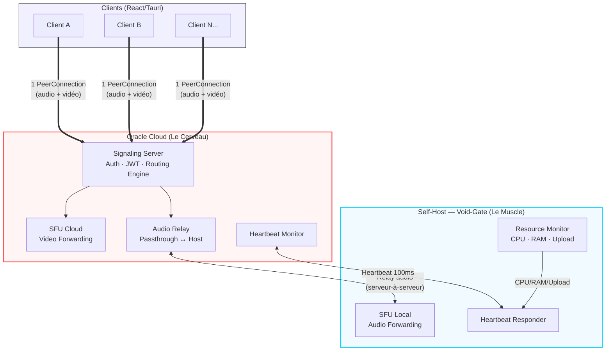

---

## 2. Topologie Réseau

### 2.1 Connexion Client (unique)

Chaque client établit **une seule PeerConnection** vers Oracle. Il ne connaît jamais l'existence du self-host. Le signaling server (Oracle) reçoit les flux audio et vidéo, puis décide en interne où les router.

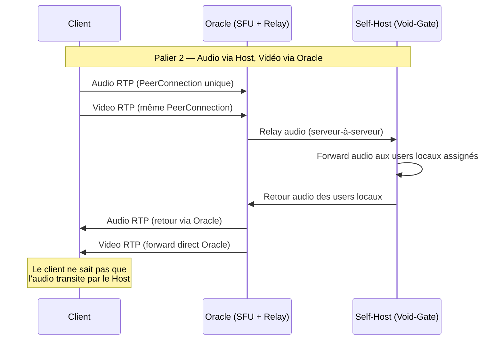

### 2.2 Lien Inter-Serveur (Oracle ↔ Void-Gate)

Le lien relay entre Oracle et le self-host transporte **uniquement les flux audio** (en palier 2+). La vidéo ne touche jamais le self-host.

Deux options de transport :

| Transport | Latence | Fiabilité | Usage recommandé |
|---|---|---|---|
| **UDP brut** | ~1-5ms | Best-effort | Production (recommandé) |
| **WebSocket** | ~5-15ms | Fiable (TCP) | Fallback si UDP bloqué |

#### Coût bande passante du relay

Le relay est bidirectionnel : Oracle envoie les streams des clients vers le Host, et le Host renvoie les streams des users locaux vers Oracle.

`relay_bandwidth = N × 48 kbps × 2 (bidirectionnel)`

| N users | Bande passante relay | % de Oracle 1 Gbps |
|---|---|---|
| 10 | 960 kbps | 0.1% |
| 50 | 4.8 Mbps | 0.5% |
| 100 | 9.6 Mbps | 1.0% |
| 300 | 28.8 Mbps | 2.9% |

Le coût du relay est **négligeable** par rapport à la bande passante totale.

---

## 3. Paliers de Routing

### 3.1 Palier 1 — Tout Self-Host

**Conditions d'activation** : `upload_total < 70% × host_capacity`

Oracle reçoit tous les flux via les PeerConnections clientes, puis relaye la totalité (audio + vidéo) vers le Host via le lien serveur-à-serveur. Le Host effectue l'intégralité du forwarding SFU et renvoie les flux à Oracle, qui les distribue aux clients.

Oracle agit comme un **proxy transparent**. Le Host réalise tout le travail SFU.

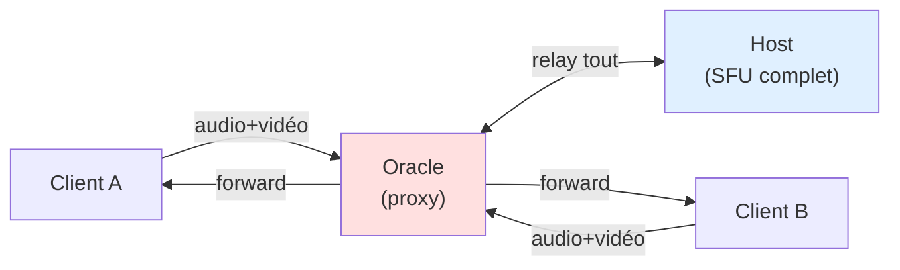

#### Formules

```
host_egress = N × (N-1) × bitrate_audio + S × (N-1) × bitrate_video
```

Où `N` = nombre total d'utilisateurs, `S` = nombre de streamers vidéo.

#### Exemple — 10 users audio, 0 vidéo, host fibre 300 Mbps

```
host_egress = 10 × 9 × 48 kbps = 4 320 kbps = 4.3 Mbps
utilisation = 4.3 / 300 000 = 1.4%
→ Palier 1 ✅ (bien en dessous du seuil de 70%)
```

**Trafic Oracle** : relay uniquement (~960 kbps). Coût cloud **quasi nul**.

---

### 3.2 Palier 2 — Split Audio / Vidéo

**Conditions d'activation** :
- `host_total_egress ≥ 70% × host_capacity`
- `host_audio_only < 70% × host_capacity`

Le forwarding audio reste sur le Host (via relay). Le forwarding vidéo est assuré directement par Oracle.

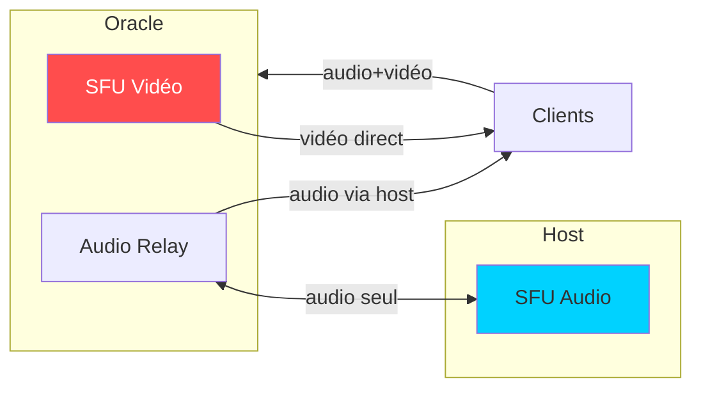

#### Formules

```
host_egress  = N × (N-1) × 48 kbps              (audio uniquement)
oracle_egress = S × (N-1) × 2 000 kbps           (vidéo uniquement)
```

#### Exemple — 13 users, 3 caméras, host fibre 300 Mbps

**Sans split (tout sur host)** :

```
audio  = 13 × 12 × 48   =   7 488 kbps =   7.5 Mbps
vidéo  = 3  × 12 × 2000  =  72 000 kbps =  72.0 Mbps
total  = 79.5 Mbps → 26.5% de 300M ✅ ... mais si tous ont la caméra :
vidéo  = 13 × 12 × 2000  = 312 000 kbps = 312 Mbps
total  = 319.5 Mbps → 106% ❌ (saturation host)
```

**Avec split Palier 2** (13 users, tous caméra) :

```
host_egress   = 13 × 12 × 48   =  7.5 Mbps   →  2.5% de 300M ✅
oracle_egress = 13 × 12 × 2000 = 312 Mbps     → 31.2% de 1 Gbps ✅
```

La vidéo représente **97.6%** de la bande passante. En ne déplaçant que la vidéo vers Oracle, le host passe de 106% saturé à 2.5% de charge.

---

### 3.3 Palier 2.5 — Split par Qualité de Connexion

**Conditions d'activation** :
- `host_audio_egress ≥ 70% × host_capacity` (le host ne peut plus porter tout l'audio)
- Le host reste joignable (heartbeat OK)

Au lieu de migrer l'intégralité vers Oracle, les utilisateurs sont **répartis entre Host et Oracle** selon leur qualité de connexion :

- **Mauvaises connexions** (ADSL, 4G) → audio forwardé par le Host (latence minimale, ~5ms)
- **Bonnes connexions** (fibre) → audio forwardé par Oracle (tolère ~25ms de latence)

Les deux SFU échangent les streams sources via le relay, de sorte que chacun dispose de **tous les N flux** et peut forwarder à ses utilisateurs assignés.

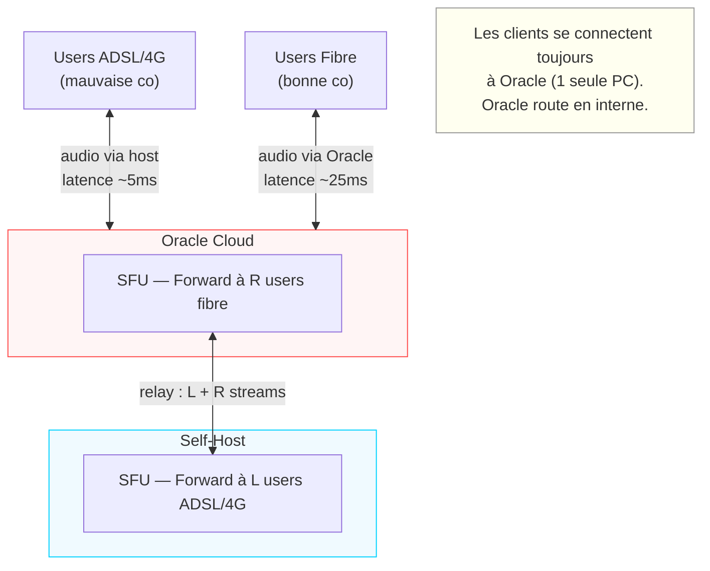

#### Formules

Calcul du nombre optimal de users locaux (`L`) :

```
L = floor((0.70 × host_upload) / (N × bitrate_audio))
R = N - L
```

Charge résultante :

```
host_egress   = L × N × bitrate_audio  + relay_out
oracle_egress = R × N × bitrate_audio  + relay_out + video_egress
relay_cost    = N × bitrate_audio × 2  (négligeable)
```

#### Exemple — 100 users audio, host 300 Mbps, Oracle 1 Gbps

**Sans split (Palier 3 — tout Oracle)** :

```
oracle_egress = 100 × 99 × 48 = 475 200 kbps = 475 Mbps (47.5% d'Oracle)
host_egress   = 0
```

**Avec Palier 2.5** :

```
L = floor((0.70 × 300 000) / (100 × 48))
L = floor(210 000 / 4 800)
L = floor(43.75) = 43 users sur le host
R = 100 - 43 = 57 users sur Oracle

host_egress   = 43 × 100 × 48 = 206 400 kbps = 206 Mbps → 69% de 300M ✅
oracle_egress = 57 × 100 × 48 = 273 600 kbps = 274 Mbps → 27% de 1G  ✅
```

**Capacité combinée** : 206 + 274 = **480 Mbps** de forwarding audio, contre 300 (host seul) ou 475 (Oracle seul). Les deux infrastructures travaillent en parallèle.

#### Capacité maximale par canal (Palier 2.5)

```
N² × bitrate ≤ (0.70 × host_upload) + (0.70 × oracle_upload)
N² × 48 ≤ 210 000 + 700 000
N² ≤ 18 958
N ≤ ~137 users par canal (audio)
```

Comparaison :

| Palier | Max users / canal (audio) |
|---|---|
| Palier 1 (host 300M seul) | 79 |
| Palier 3 (Oracle 1G seul) | 65 *(limité CPU ARM)* |
| **Palier 2.5 (host + Oracle)** | **~137** |

---

### 3.4 Palier 3 — Tout Oracle (Fallback)

**Conditions d'activation** :
- Le Host est injoignable (heartbeat timeout)
- Aucun self-host enregistré pour la guild concernée

Oracle assure l'intégralité du forwarding SFU. Comportement classique.

```
oracle_egress = N × (N-1) × bitrate_audio + S × (N-1) × bitrate_video
```

Ce palier sert de **filet de sécurité**. Il est activé automatiquement en cas de défaillance du host et ne nécessite aucune action côté client (cf. [Section 5 — Failover](#5-failover--300ms)).

---

## 4. Algorithme de Décision

### 4.1 Arbre de Décision

À chaque événement modifiant l'état d'un canal (join, leave, stream start/stop), le Routing Engine recalcule le palier optimal :

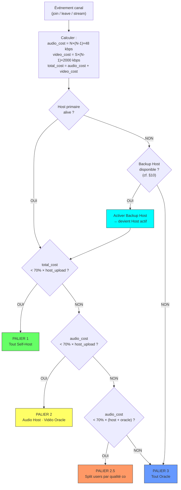

### 4.2 Paramètres Configurables

| Paramètre | Défaut | Description |
|---|---|---|
| `SELFHOST_COMFORT_THRESHOLD` | 0.70 | Taux max d'utilisation du host avant escalade |
| `ESCALATE_THRESHOLD` | 0.85 | Seuil de déclenchement immédiat vers le palier supérieur |
| `DESCALE_THRESHOLD` | 0.50 | Seuil sous lequel un retour au palier inférieur est autorisé |
| `HEARTBEAT_INTERVAL_MS` | 100 | Fréquence d'envoi du heartbeat Oracle → Host |
| `HEARTBEAT_TIMEOUT_MS` | 300 | 3 heartbeats manqués = host déclaré DOWN |
| `AUDIO_BITRATE_KBPS` | 48 | Débit Opus audio estimé |
| `VIDEO_BITRATE_KBPS` | 2 000 | Débit VP8/H264 vidéo estimé |
| `MIN_GOOD_UPLOAD_KBPS` | 1 000 | Upload minimum pour qualifier une "bonne connexion" (Palier 2.5) |
| `BACKUP_HOST_MIN_UPLOAD_KBPS` | 50 000 | Upload minimum pour être éligible backup host |
| `BACKUP_HOST_MAX_CPU_PERCENT` | 80 | CPU max pour être éligible backup host |
| `BACKUP_HOST_MAX_RAM_PERCENT` | 85 | RAM max pour être éligible backup host |
| `BACKUP_HOST_MAX_LATENCY_MS` | 100 | Latence max vers Oracle pour être éligible backup host |
| `BACKUP_HOST_ELECTION_INTERVAL_MS` | 5 000 | Intervalle entre deux réévaluations d'éligibilité |
| `BACKUP_HOST_STANDBY_HB_MS` | 500 | Fréquence heartbeat du backup host en standby |
| `BACKUP_HOST_ACTIVATION_TIMEOUT_MS` | 400 | Temps max pour que le backup confirme sa prise de relais |
| `VOIDGATE_SCORE_BONUS` | 0.15 | Bonus ajouté au score d'un Void-Gate dédié (cf. §10.4) |
| `HOST_PROMOTION_SCORE_DELTA` | 0.20 | Écart de score minimum pour déclencher une promotion (anti-flapping) |
| `HOST_ELECTION_COOLDOWN_MS` | 10 000 | Délai minimum entre deux changements de host primaire (hors failover) |

### 4.3 Transitions entre Paliers

Un mécanisme d'**hystérésis** empêche le flapping (oscillation rapide entre paliers). Le seuil de montée (70%) est supérieur au seuil de descente (50%).

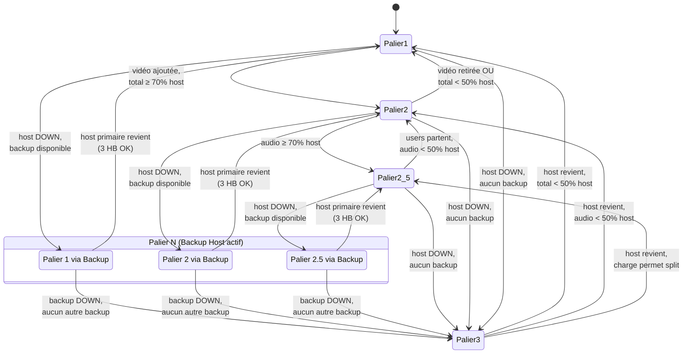

---

## 5. Failover (< 300ms)

### 5.1 Mécanisme de Heartbeat

Oracle envoie un heartbeat ping au Host toutes les 100ms. Si **3 pings consécutifs** restent sans réponse (300ms), le Host est déclaré DOWN.

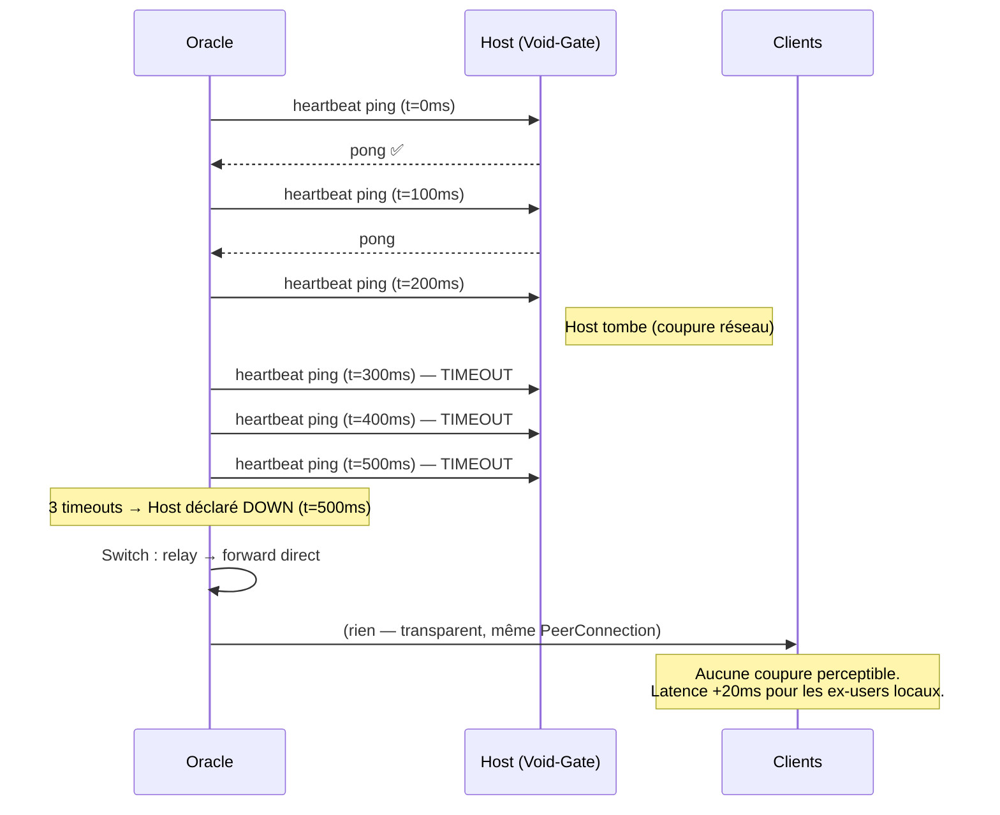

### 5.2 Chaîne de Failover (avec Backup Host)

Lorsque le host primaire est déclaré DOWN, Oracle ne bascule plus immédiatement en Palier 3. La chaîne de failover est désormais :

**Host Primaire → Backup Host → Oracle (Palier 3)**

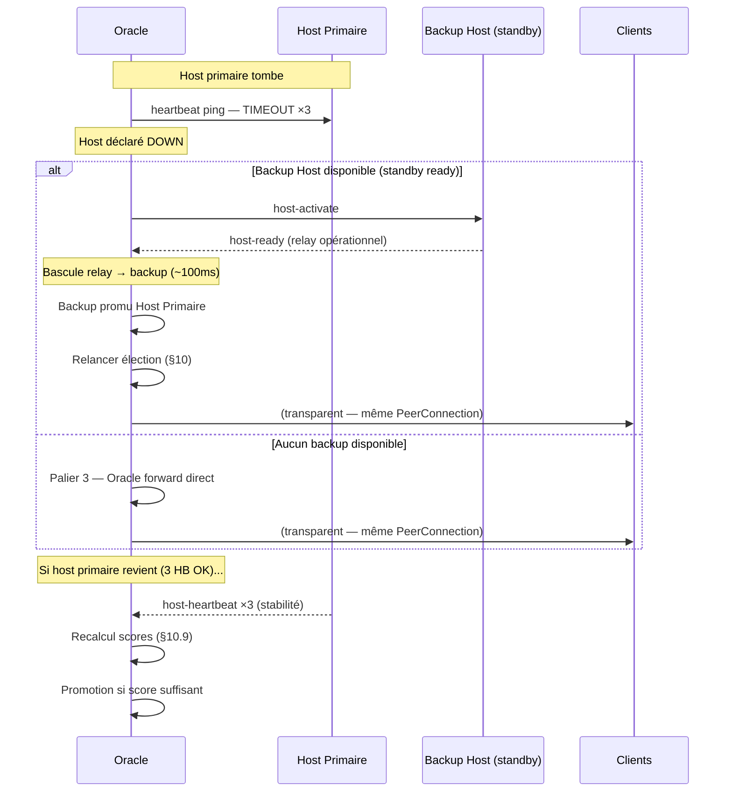

### 5.3 Transparence Client

Le client étant connecté **uniquement à Oracle** via une PeerConnection unique, le failover est invisible :

| État | Chemin audio |
|---|---|
| **Host primaire vivant** | Client → Oracle → relay → Host → Oracle → Client |
| **Backup Host actif** | Client → Oracle → relay → Backup → Oracle → Client |
| **Tout Oracle (Palier 3)** | Client → Oracle → forward direct → Client |

Aucune renégociation SDP, aucun changement de PeerConnection. Le seul effet observable est une augmentation de latence de ~20ms pour les utilisateurs qui bénéficiaient de la proximité du host.

### 5.4 Reprise (Host Recovery)

Lorsque le Host primaire redevient joignable :

1. Le Host primaire envoie un heartbeat à Oracle.
2. Oracle attend **3 heartbeats consécutifs réussis** (300ms de stabilité).
3. Oracle **recalcule les scores** de tous les candidats (cf. [§10.4](#104-algorithme-délection-unifié-scoring)).
4. Si l'ancien primaire a un score supérieur au primaire actuel (delta ≥ `HOST_PROMOTION_SCORE_DELTA`) → il reprend le rôle via une **migration progressive**.
5. Sinon → il est élu backup (ou reste en réserve).
6. Ce mécanisme évite de réinstaurer automatiquement un host qui n'est plus le meilleur candidat.

---

## 6. Protocole WebSocket — Nouveaux Messages

### 6.1 Void-Gate → Oracle (lien serveur-à-serveur)

**Candidature Void-Gate** (machine dédiée souhaitant participer à l'élection host) :

```json
{
  "type": "host-register",
  "guildId": "abc-123",
  "uploadCapacityKbps": 300000,
  "cpuPercent": 12,
  "ramPercent": 18,
  "dedicated": true
}
```

> Le `host-register` n'attribue **plus automatiquement** le rôle de host primaire. Le Void-Gate entre dans le pool de candidats et est évalué par le scoring unifié (cf. [§10.4](#104-algorithme-délection-unifié-scoring)). Le champ `dedicated: true` lui octroie un bonus de score.

**Heartbeat (périodique)** :

```json
{
  "type": "host-heartbeat",
  "cpuPercent": 45,
  "ramPercent": 22,
  "uploadUsedKbps": 85000
}
```

**Arrêt gracieux** :

```json
{
  "type": "host-shutdown"
}
```

### 6.2 Oracle → Host (lien serveur-à-serveur)

**Configuration du relay** :

```json
{
  "type": "relay-config",
  "guildId": "abc-123",
  "channels": ["voice-1", "voice-2"],
  "assignedUsers": ["user-a", "user-b", "user-c"]
}
```

**Flux audio relayé** (transport UDP recommandé) :

```json
{
  "type": "relay-audio",
  "channelId": "voice-1",
  "userId": "user-a",
  "rtp": "<base64-encoded RTP packet>"
}
```

### 6.3 Oracle → Client (WebSocket existant, nouveaux types)

**Information de routing** (informatif, affiché dans l'UI) :

```json
{
  "type": "routing-info",
  "palier": 2,
  "audioVia": "self-host",
  "videoVia": "cloud"
}
```

Ce message est **informatif uniquement**. Le client n'a aucune action à entreprendre — le routing est géré côté serveur.

### 6.4 Élection & Coordination des Hosts

#### Client → Oracle (candidature & capacités)

**Capacités du pair** (envoyé périodiquement, toutes les 5s) :

```json
{
  "type": "peer-capabilities",
  "uploadCapacityKbps": 150000,
  "cpuPercent": 35,
  "ramPercent": 42,
  "latencyToOracleMs": 18,
  "hostEligible": true
}
```

> Le champ `hostEligible` est un **opt-in** : le pair accepte d'être candidat au rôle de host (primaire ou backup). Par défaut `false`. Contrôlé dans les paramètres utilisateur du client. Un pair avec `hostEligible: false` ne sera **jamais** élu host.

**Acceptation du rôle de host** (primaire ou backup) :

```json
{
  "type": "host-accept",
  "role": "primary"
}
```

**Refus du rôle** :

```json
{
  "type": "host-decline"
}
```

**Confirmation de disponibilité** (relay opérationnel) :

```json
{
  "type": "host-ready"
}
```

#### Oracle → Client (élection & activation)

**Désignation comme host** (primaire ou backup) :

```json
{
  "type": "host-designate",
  "guildId": "abc-123",
  "role": "primary",
  "reason": "highest-score"
}
```

```json
{
  "type": "host-designate",
  "guildId": "abc-123",
  "role": "backup",
  "reason": "second-highest-score"
}
```

**Promotion** (backup → primaire, car l'ancien primaire est DOWN ou un meilleur candidat est apparu) :

```json
{
  "type": "host-promote",
  "guildId": "abc-123",
  "fromRole": "backup",
  "toRole": "primary",
  "reason": "primary-down"
}
```

**Révocation du rôle** :

```json
{
  "type": "host-revoke",
  "role": "primary",
  "reason": "better-candidate"
}
```

**Activation d'urgence** (le primaire est DOWN, le backup prend le relais immédiatement) :

```json
{
  "type": "host-activate",
  "guildId": "abc-123",
  "channels": ["voice-1", "voice-2"],
  "assignedUsers": ["user-a", "user-b", "user-c"]
}
```

---

## 7. Estimations de Capacité

### 7.1 Par Canal Vocal

| Mode | Palier | Max users / canal |
|---|---|---|
| Audio seul | Palier 1 (host 300M) | **79** |
| Audio seul | Palier 2.5 (host 300M + Oracle 1G) | **~137** |
| Audio + Vidéo (tous caméra) | Palier 2 | **~19** |
| Audio + Vidéo (3-5 caméras) | Palier 2 | **~50-70** |

### 7.2 Par Serveur (Guild)

Pour un host disposant d'une connexion fibre 300 Mbps :

| Taille de guild | Canaux vocaux actifs | Users / canal | Max users / guild |
|---|---|---|---|
| Petite (entre amis) | 2-3 | 3-5 | **~15** |
| Moyenne (communauté) | 5-10 | 5-10 | **~100** |
| Grande | 10-20 | 10-15 | **~300** |
| Très grande | 20+ | 15-20 | **~300-400** |

### 7.3 Par Plateforme (Oracle 4 OCPU ARM / 24 GB / 1 Gbps)

| Scénario | Guilds actives | Users total | Oracle bande passante |
|---|---|---|---|
| Audio pur (tout self-host) | 200 | **~5 000** | ~0 (signaling) |
| Mix réaliste | 100 audio + 5 vidéo | **~1 600** | ~570 Mbps (57%) |
| Charge maximale | 100 audio + 10 vidéo | **~3 000** | ~700 Mbps (70%) |

### 7.4 Démonstration — Économie de Bande Passante Oracle

**Scénario** : soirée gaming typique, 1 guild, session de 3 heures.

| Heure | Users | Vidéo | Palier | Host upload | Oracle upload |
|---|---|---|---|---|---|
| 20h00 | 2 | — | 1 | 96 kbps | ~0 |
| 20h15 | 5 | — | 1 | 960 kbps | ~0 |
| 20h30 | 10 | — | 1 | 4.3 Mbps | ~0 |
| 21h00 | 10 | 2 cams | 2 | 4.3 Mbps | 36 Mbps |
| 21h15 | 13 | 3 cams | 2 | 7.5 Mbps | 72 Mbps |
| 21h30 | 15 | 3 cams | 2 | 10 Mbps | 84 Mbps |
| 22h00 | 10 | 1 cam | 2 | 4.3 Mbps | 18 Mbps |
| 22h30 | 5 | — | 1 | 960 kbps | ~0 |
| 23h00 | 2 | — | 1 | 96 kbps | ~0 |

#### Bilan

```
Durée où Oracle forward de la vidéo : ~1h15 sur 3h (42%)
Bande passante Oracle moyenne sur 3h : ~35 Mbps

Comparaison tout-Oracle (sans self-host) :
  Bande passante Oracle moyenne sur 3h : ~150 Mbps

Économie : (150 - 35) / 150 = 77%
```

**Le routing hybride réduit le trafic Oracle de ~77%** sur ce scénario représentatif.

---

## 8. Sécurité

### 8.1 Authentification Nonce-Burn

Chaque requête signée utilise un nonce unique (signature Ed25519). Après vérification, le nonce est « brûlé » (stocké comme utilisé). Toute tentative de rejouer la même signature est rejetée. Les nonces expirent après **10 minutes**.

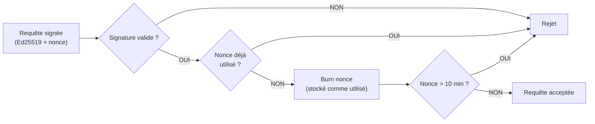

### 8.2 Lien Inter-Serveur (Oracle ↔ Void-Gate)

Le relay entre Oracle et le self-host est authentifié via un **secret partagé** dérivé de la keypair Ed25519 du propriétaire de la guild. Le transport est chiffré via **TLS** (WebSocket) ou **DTLS** (UDP brut).

### 8.3 Isolation des Guilds

Chaque self-host ne reçoit que les flux audio de **sa propre guild**. Le Routing Engine filtre par `guildId` — le trafic inter-guild est structurellement impossible.

---

## 9. Observabilité (Prometheus)

Nouvelles métriques dédiées au routing hybride. Le préfixe `void_` distingue ces métriques des métriques SFU internes (`sfu_*`).

| Métrique | Type | Description |
|---|---|---|
| `void_active_palier` | Gauge (par canal) | Palier de routing actif (1, 2, 2.5, 3) |
| `void_host_upload_percent` | Gauge (par guild) | Taux d'utilisation de l'upload du host |
| `void_relay_bandwidth_bps` | Gauge | Trafic Oracle ↔ Host (relay) |
| `void_failover_total` | Counter | Nombre total de failovers host |
| `void_failover_duration_ms` | Histogram | Durée de bascule lors d'un failover |
| `void_palier_transitions_total` | Counter (par from/to) | Nombre de transitions entre paliers |
| `void_users_on_host` | Gauge (par guild) | Utilisateurs assignés au self-host |
| `void_users_on_cloud` | Gauge (par guild) | Utilisateurs assignés à Oracle |
| `void_backup_host_elections_total` | Counter | Nombre total d'élections de backup host |
| `void_backup_host_failover_total` | Counter | Nombre total de basculements vers un backup host |
| `void_backup_host_failover_duration_ms` | Histogram | Durée de bascule primaire → backup |
| `void_backup_host_active` | Gauge (par guild) | 1 si un backup host est actif (forwarding), 0 sinon |
| `void_backup_host_standby` | Gauge (par guild) | 1 si un backup host est en standby, 0 sinon |
| `void_backup_host_score` | Gauge (par guild) | Score du backup host élu (pour observabilité) |
| `void_host_elections_total` | Counter | Nombre total d'élections de host primaire |
| `void_host_promotions_total` | Counter | Nombre de promotions backup → primaire |
| `void_host_primary_score` | Gauge (par guild) | Score du host primaire actuel |
| `void_host_primary_type` | Gauge (par guild) | Type du host primaire (1 = Void-Gate, 2 = Peer) |
| `void_host_eligible_peers` | Gauge (par guild) | Nombre de pairs éligibles au rôle de host |

---
## 10. Élection des Hosts (Primaire & Secours)

### 10.1 Principe — Élection Unifiée

Le host (primaire et secours) **n'est pas** le premier arrivé dans le canal, ni un volontaire automatiquement accepté. Oracle exécute un **algorithme d'élection par scoring** parmi tous les candidats éligibles :

- Le candidat **#1** (meilleur score) → **Host Primaire** (relay SFU actif)
- Le candidat **#2** → **Host Secours / Backup** (standby, prêt à prendre le relais)

Deux types de candidats coexistent dans le même pool :

| Type | Source | Bonus | Avantage |
|---|---|---|---|
| **Void-Gate** (dédié) | Machine dédiée, `host-register` | `+VOIDGATE_SCORE_BONUS` (+0.15) | Ressources non partagées avec du gaming, uptime stable |
| **Peer** (pair ordinaire) | Client vocal, `peer-capabilities` avec `hostEligible: true` | Aucun | Zéro configuration, tout automatique |

Un Void-Gate sur ADSL (10 Mbps upload) **ne battra pas** un peer sur fibre (300 Mbps) malgré son bonus. Le scoring reste souverain.

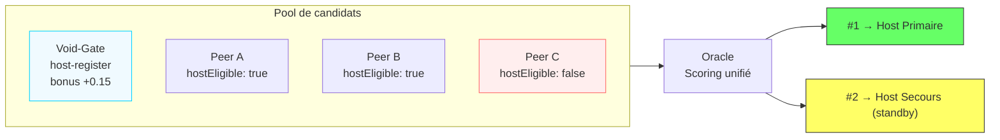

### 10.2 Collecte des Capacités (peer-capabilities)

Chaque client connecté à un canal vocal envoie périodiquement (toutes les **5 secondes**) un message `peer-capabilities` à Oracle via le WebSocket existant :

```json
{
  "type": "peer-capabilities",
  "uploadCapacityKbps": 150000,
  "cpuPercent": 35,
  "ramPercent": 42,
  "latencyToOracleMs": 18,
  "hostEligible": true
}
```

Oracle stocke ces métriques en mémoire, associées à la session du pair. Elles servent de base au scoring d'éligibilité.

> **Opt-in `hostEligible`** : par défaut `false`. L'utilisateur active cette option dans ses paramètres client. Seuls les pairs avec `hostEligible: true` entrent dans le pool de candidats. Cela permet à un joueur sur laptop en WiFi de ne pas se retrouver élu host malgré lui.

> **Mesure de l'upload côté client** : le client estime son débit montant via un test ponctuel au join (envoi d'un burst de paquets chronométré vers Oracle), puis affine la valeur en continu à partir des stats WebRTC (`RTCStatsReport.bytesSent`).

> **Mesure de la latence** : le RTT vers Oracle est déjà disponible via `RTCIceCandidatePairStats.currentRoundTripTime`.

### 10.3 Critères d'Éligibilité

Un candidat (Void-Gate ou pair) est **éligible** si et seulement si :

| Critère | Seuil | Paramètre |
|---|---|---|
| Upload disponible | ≥ 50 Mbps | `BACKUP_HOST_MIN_UPLOAD_KBPS` |
| Utilisation CPU | < 80% | `BACKUP_HOST_MAX_CPU_PERCENT` |
| Utilisation RAM | < 85% | `BACKUP_HOST_MAX_RAM_PERCENT` |
| Latence vers Oracle | < 100ms | `BACKUP_HOST_MAX_LATENCY_MS` |
| Opt-in host | `hostEligible: true` (pair) ou `host-register` (Void-Gate) | — |
| Connecté à un canal vocal de la guild | — | — |

Si **aucun candidat** ne remplit ces critères → pas de host, Palier 3 pur (tout Oracle).
Si **un seul candidat** → il est primaire, pas de backup.

### 10.4 Algorithme d'Élection Unifié (Scoring)

Oracle calcule un **score composite** pour chaque candidat éligible :

```
score_base = w₁ × norm(upload) + w₂ × (1 - norm(latency)) + w₃ × (1 - norm(cpu)) + w₄ × (1 - norm(ram))

score_final = score_base + (VOIDGATE_SCORE_BONUS si dedicated == true, sinon 0)
```

Où :
- `norm(x) = (x - min) / (max - min)` parmi les candidats éligibles (si un seul candidat : `norm(x) = 1`)
- **Poids par défaut** : `w₁ = 0.40`, `w₂ = 0.30`, `w₃ = 0.15`, `w₄ = 0.15`
- **Bonus Void-Gate** : `VOIDGATE_SCORE_BONUS = 0.15` — reflète l'avantage d'une machine dédiée (pas de jeu/app qui consomme les ressources en parallèle)

Le classement détermine les rôles :

```
candidats.sort_by(score_final, DESC)

candidats[0] → Host Primaire
candidats[1] → Host Secours (standby)
candidats[2..] → réserve (réélection si besoin)
```

#### Exemple de scoring

| Candidat | Upload | Latence | CPU | RAM | Dédié | Score base | Bonus | Score final |
|---|---|---|---|---|---|---|---|---|
| Void-Gate (ADSL) | 10 Mbps | 45ms | 8% | 12% | ✅ | 0.32 | +0.15 | **0.47** |
| Pair A (fibre) | 250 Mbps | 15ms | 40% | 55% | ❌ | 0.78 | 0 | **0.78** ← #1 Primaire |
| Pair B (fibre) | 150 Mbps | 22ms | 30% | 40% | ❌ | 0.65 | 0 | **0.65** ← #2 Backup |
| Void-Gate (fibre) | 300 Mbps | 12ms | 5% | 10% | ✅ | 0.95 | +0.15 | **1.10** ← #1 si présent |

→ Un Void-Gate sur fibre domine grâce au bonus. Un Void-Gate sur ADSL perd face à un peer fibre malgré le bonus. **Le meilleur gagne, toujours.**

#### Déclencheurs de l'élection

L'algorithme est (ré)exécuté lors des événements suivants :

| Événement | Raison |
|---|---|
| **Peer join** (canal vocal) | Nouveau candidat potentiel |
| **Peer leave** (canal vocal) | Le host élu peut être parti |
| **host-register** | Un Void-Gate vient de se déclarer candidat |
| **host-shutdown** | Le Void-Gate se retire |
| **Failover accompli** | L'ancien backup est maintenant actif → réélection backup |
| **peer-capabilities** (changement significatif) | Delta > 10% sur un critère |
| **Timer périodique** | Toutes les `BACKUP_HOST_ELECTION_INTERVAL_MS` (5s) — filet de sécurité |

### 10.5 Élection Initiale (Début de Session)

Quand le premier pair rejoint un canal vocal vide, il n'y a qu'un seul utilisateur — aucune utilité à élire un host (pas de relay nécessaire). L'élection se déclenche **dès que N ≥ 2 pairs** sont connectés :

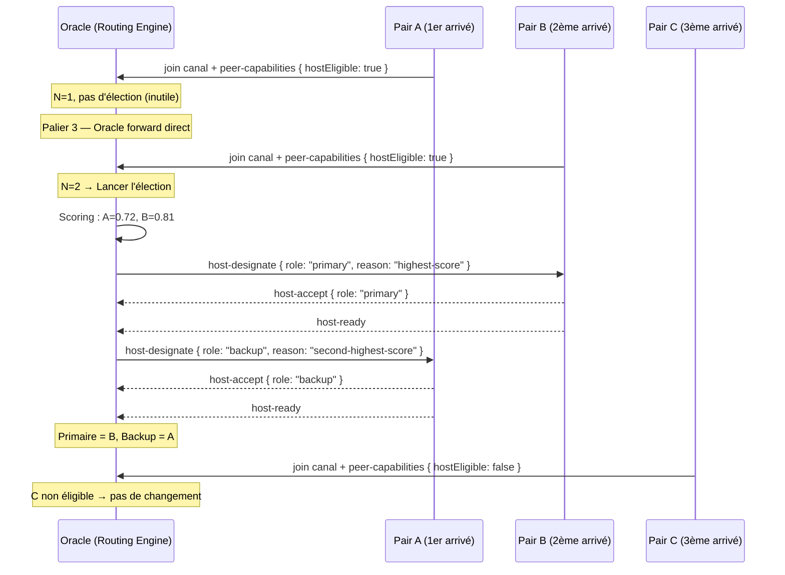

Le pair A (premier arrivé) n'est **pas automatiquement** le host primaire — c'est B qui l'emporte par son score supérieur.

### 10.6 Promotion / Destitution en Cours de Session

Si un meilleur candidat apparaît en cours de session (nouveau pair rejoint, Void-Gate s'enregistre, ou les métriques changent), Oracle peut **promouvoir** un candidat et **destituer** l'actuel.

#### Anti-flapping

Pour éviter des changements incessants de host primaire, deux garde-fous :

1. **Écart de score minimum** (`HOST_PROMOTION_SCORE_DELTA = 0.20`) : un nouveau candidat ne remplace le primaire actuel que si son score dépasse celui du primaire d'au moins 0.20.
2. **Cooldown** (`HOST_ELECTION_COOLDOWN_MS = 10 000`) : après un changement de primaire, aucun autre changement n'est possible pendant 10 secondes (sauf failover).

> **Exception** : les failovers (host DOWN) ignorent le cooldown — la bascule d'urgence est toujours immédiate.

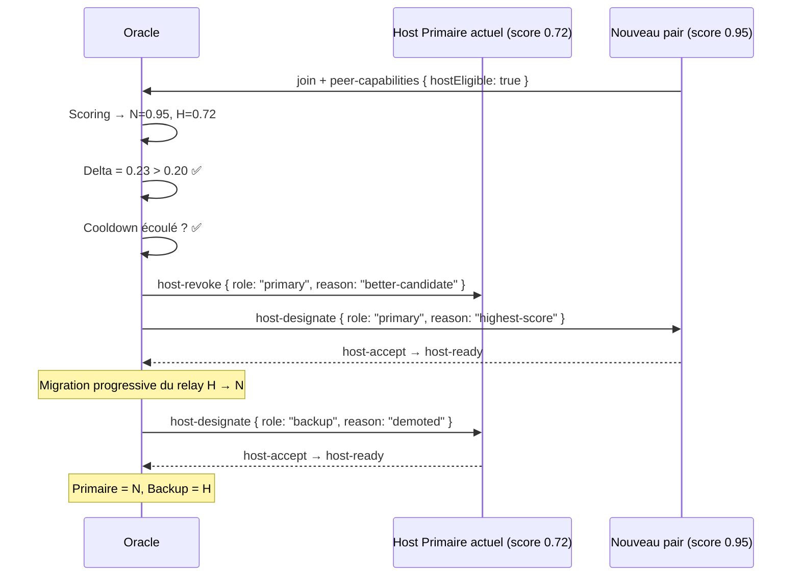

#### Migration progressive

Lors d'un changement de primaire (hors failover), Oracle migre le relay **canal par canal** pour éviter toute coupure audio :

1. Oracle configure le nouveau primaire sur le canal 1 (`relay-config`).
2. Oracle bascule le relay audio du canal 1 vers le nouveau primaire.
3. Oracle confirme la stabilité (1s), puis passe au canal 2.
4. Une fois tous les canaux migrés, l'ancien primaire est rétrogradé en backup.

### 10.7 Cycle de Vie du Host Secours (Standby)

Une fois élu #2 et confirmé (`host-ready`), le backup host entre en mode **standby** :

1. **Socket pré-ouvert** : le backup maintient une connexion relay (WebSocket ou UDP) vers Oracle, sans trafic actif. Coût = ~0 bande passante.
2. **Heartbeat standby** : Oracle envoie un heartbeat au backup toutes les `BACKUP_HOST_STANDBY_HB_MS` (500ms). Si le backup manque 3 HB consécutifs (1.5s), il est déclaré indisponible et une nouvelle élection est lancée.
3. **Pas d'impact utilisateur** : le backup reste un client normal (audio/vidéo), il ne forward rien tant qu'il est en standby.

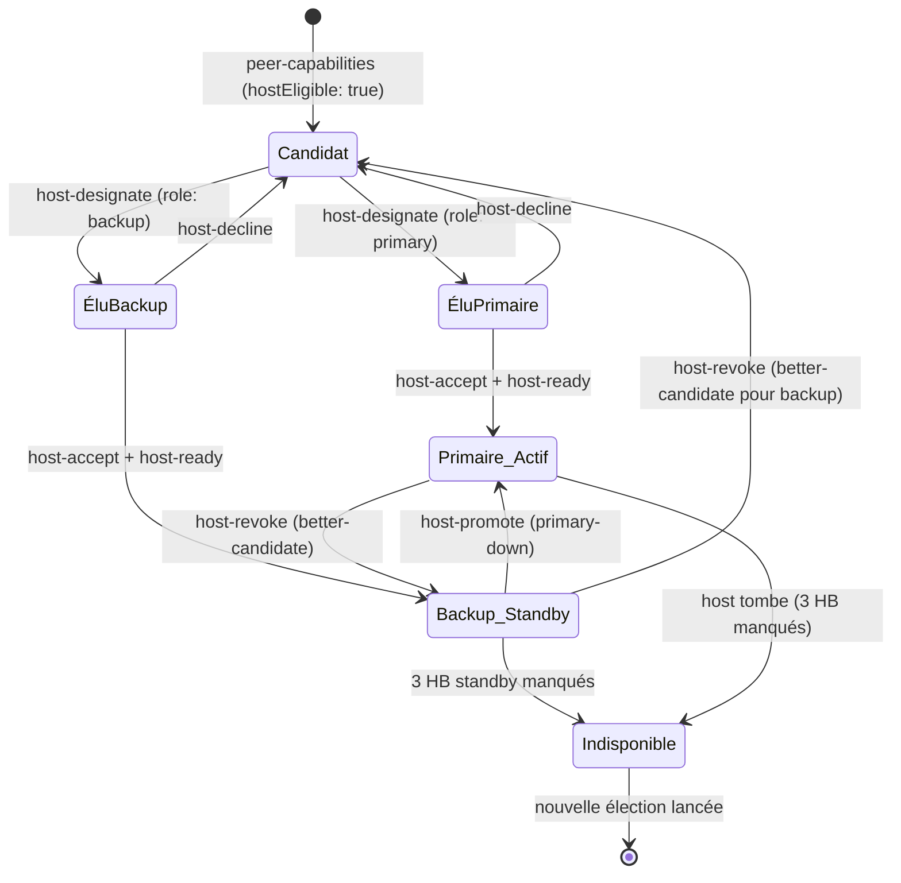

### 10.8 Activation du Backup (Failover)

Lorsque le host primaire est déclaré DOWN (3 heartbeats manqués, cf. §5.1) :

1. Oracle vérifie l'existence d'un backup host en standby.
2. Oracle envoie `host-activate` avec la liste des canaux et utilisateurs assignés.
3. Le backup doit confirmer avec `host-ready` dans un délai de `BACKUP_HOST_ACTIVATION_TIMEOUT_MS` (400ms).
4. Si la confirmation arrive à temps → le backup **devient le host primaire**. Oracle bascule le relay vers lui.
5. Si le timeout expire → Oracle passe en **Palier 3** (tout Oracle).
6. Dans les deux cas, une **nouvelle élection** est immédiatement lancée pour désigner un nouveau backup standby (#2).

#### Timing de la bascule

```
t=0ms      : dernier heartbeat réussi du host primaire
t=300ms    : host déclaré DOWN (3 HB manqués)
t=300ms    : Oracle envoie host-activate au backup
t=~350ms   : backup confirme (host-ready)
t=~400ms   : relay audio basculé vers le backup
─────────────────────────────────────────────────
Total : ~400ms de bascule (vs ~300ms pour Palier 3 pur)
```

### 10.9 Retour d'un Host Évincé / Tombé

Deux scénarios :

#### Scénario A — L'ancien primaire revient après un crash

1. Oracle reçoit 3 heartbeats consécutifs réussis (300ms de stabilité).
2. Oracle **recalcule les scores** : l'ancien primaire entre à nouveau dans le pool de candidats.
3. Si son score dépasse le primaire actuel de `HOST_PROMOTION_SCORE_DELTA` (0.20) → il reprend le rôle via une migration progressive.
4. Sinon → il devient backup (ou simple candidat en réserve).

> **Différence avec v1.1** : l'ancien primaire ne reprend **plus automatiquement** la priorité. C'est le score qui décide. Un Void-Gate qui revient après un crash peut se retrouver #2 si un peer fibre fait un meilleur job.

#### Scénario B — Un meilleur pair rejoint en cours de session

Même logique que §10.6 (promotion/destitution). Le scoring est réévalué, et si l'écart est suffisant + cooldown écoulé → le nouveau candidat est promu.

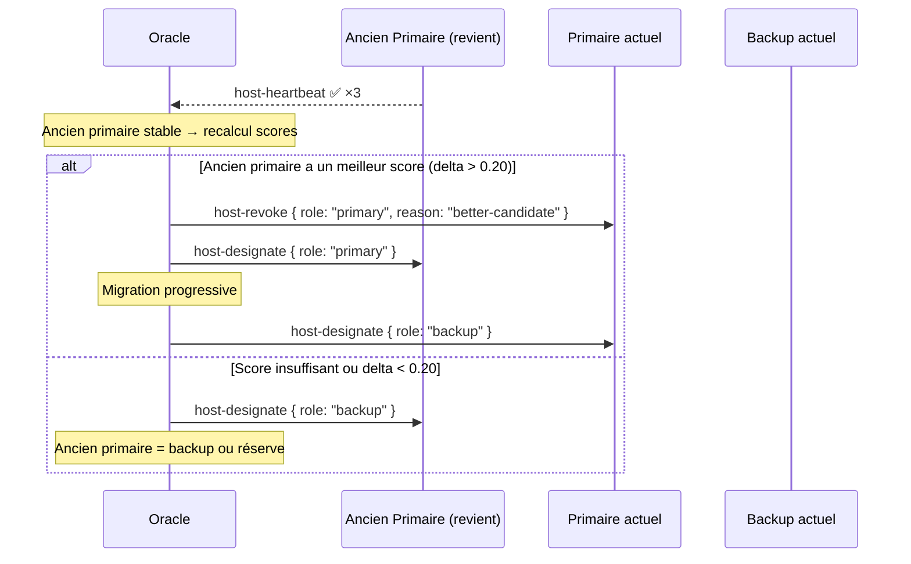

### 10.10 Cas Limites

#### Aucun pair éligible

Quand aucun pair ni Void-Gate ne remplit les critères d'éligibilité (ou tous ont `hostEligible: false`), la guild fonctionne en **Palier 3 pur** (tout Oracle). Dès qu'un candidat éligible apparaît → élection immédiate.

#### Backup host actif tombe aussi

Si le backup host tombe alors qu'il est en mode actif (forwarding), Oracle le détecte via les heartbeats (100ms, 3 manqués = DOWN). Oracle bascule immédiatement en **Palier 3** et relance l'élection pour trouver un nouveau host parmi les candidats restants.

#### Un seul candidat éligible

Il est élu primaire. Il n'y a **aucun backup**. La chaîne de failover est : Host Primaire → Oracle (Palier 3). L'élection continue de tourner toutes les 5s pour détecter un éventuel deuxième candidat.

#### Tous les Void-Gate sont sur ADSL

Si un Void-Gate a un score final inférieur à un peer malgré le bonus, le **peer est élu primaire**. Le Void-Gate peut être élu backup si son score est #2. Le bonus ne garantit pas l'élection — il donne un avantage, pas un passe-droit.

#### Le primaire élu refuse (host-decline)

Oracle passe au candidat #2. Si #2 refuse aussi → #3, etc. Si tous refusent → Palier 3 pur.

### 10.11 Exemple — Scénario Complet (Élection Unifiée)

**Contexte** : Guild "Gaming Night", soirée de 3 heures.

```
t=0s      : Pair A rejoint le vocal (upload 80 Mbps, hostEligible: true)
            N=1, pas d'élection. Palier 3.

t=10s     : Pair B rejoint (upload 250 Mbps, hostEligible: true)
            N=2 → Élection lancée
            Scores : B=0.81, A=0.58
            B élu Primaire, A élu Backup
            Oracle configure relay → Palier 1

t=5min    : Pair C rejoint (upload 40 Mbps, hostEligible: false)
            C non éligible (hostEligible: false + upload < 50 Mbps)
            Pas de changement

t=15min   : Void-Gate s'enregistre (upload 300 Mbps, dédié, latence 8ms)
            Scores : VG=0.95+0.15=1.10, B=0.81, A=0.58
            Delta VG-B = 0.29 > 0.20 → Promotion !
            VG élu Primaire, B rétrogradé Backup
            Migration progressive du relay B → VG

t=1h      : VG crash (coupure réseau)
            Oracle détecte DOWN après 300ms
            Oracle envoie host-activate à B (backup)
            B confirme en 60ms → bascule relay en ~360ms
            Nouvelle élection backup → A élu Backup standby

t=1h02    : VG revient (3 HB OK)
            Oracle recalcule : VG=1.10, B=0.81
            Delta = 0.29 > 0.20 → VG reprend le rôle primaire
            Migration progressive B → VG
            B repasse Backup, A repasse réserve

t=2h30    : Pair D rejoint (upload 500 Mbps, fibre pro, hostEligible: true)
            Scores : D=0.98, VG=1.10, B=0.81, A=0.58
            Delta VG-D = 0.12 < 0.20 → Pas de changement
            VG reste Primaire (le bonus protège)

t=2h45    : VG s'éteint (host-shutdown gracieux)
            Élection immédiate (hors cooldown car shutdown)
            Scores : D=0.98, B=0.81, A=0.58
            D élu Primaire, B élu Backup
```

