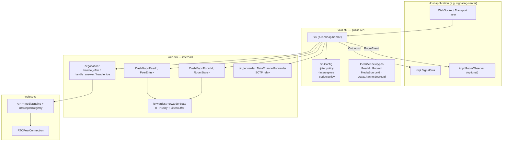
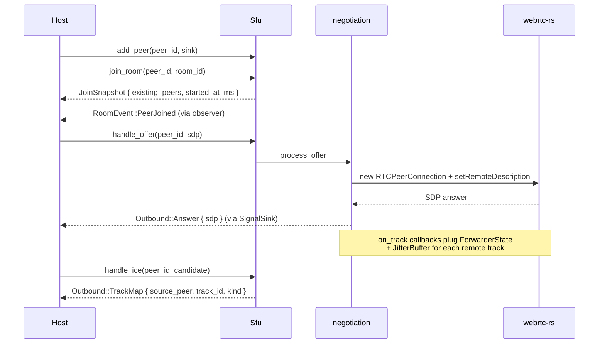

# void-sfu

Domain-agnostic **Selective Forwarding Unit (SFU)** library built on top of [`webrtc-rs`](https://github.com/webrtc-rs/webrtc). Crate `void-sfu` is the media plane of the Void platform: it handles `RTCPeerConnection`s, ICE/SDP negotiation, RTP/SCTP forwarding and codec/packet/data-channel interception — without ever speaking application-specific protocols.

> **License:** Business Source License 1.1 (BSL-1.1) — see the repository [`LICENSE`](../../LICENSE).
> Internal commercial use is governed by the BSL terms; the *change date* converts the source to GPL-3.0-or-later.

---

## Why a dedicated crate?

The signaling server (`packages/signaling-server`) used to embed both signaling **and** media forwarding in the same binary, which made it impossible to:

- swap or mock the media plane in tests,
- evolve the WebRTC stack independently of the auth/friends/REST surface,
- reuse the SFU from a future "media-only" deployment (selective sharding, dedicated SFU pod, etc.).

`void-sfu` extracts the media plane behind a strict, panic-free, **wire-format-agnostic** Rust API. The host (currently `signaling-server`) only adapts inbound/outbound messages to its own transport (`Outbound` ↔ JSON/Protobuf WebSocket frames) — everything else lives here.

---

## Design goals

| Principle | Concrete consequence |
|---|---|
| **Agnostic** | The crate has zero knowledge of channels, users, JSON, Protobuf, websockets. It only speaks `PeerId`, `RoomId`, `Outbound`, `IceCandidate`. |
| **Zero-copy data path** | RTP packets travel as `bytes::Bytes` (Arc-backed, no heap copy). Identifiers are `Arc<str>` newtypes — cloning is a refcount bump. |
| **No panics** | Every fallible operation returns `Result<_, SfuError>`. The crate never calls `unwrap`/`expect`/`panic!` on input from the network or host calls. |
| **Hot-pluggable extensions** | Hosts (and, in a future iteration, sandboxed WASM modules) attach packet interceptors, codec policies and data-channel interceptors at runtime through opaque trait objects. |
| **Concurrency-first** | Internal state lives in `DashMap`/`DashSet` so RTP/SCTP hot paths never block on a global write lock. |

---

## Architecture



### Module map

| Module | Role |
|---|---|
| `lib.rs` | Public re-exports + crate-level documentation. |
| `config.rs` | `SfuConfig`, `JitterPolicy`. |
| `id.rs` | `PeerId`, `RoomId`, `MediaSourceId`, `DataChannelSourceId` — `Arc<str>`-backed newtypes. |
| `models.rs` | Wire-format-agnostic value types (`IceCandidate`, `MediaKind`). |
| `signal.rs` | `SignalSink` trait + `Outbound` / `RoomEvent` / `RoomObserver`. |
| `extension.rs` | `PacketInterceptor`, `CodecPolicy`, `DataChannelInterceptor`. |
| `error.rs` | `SfuError` (zero panics, every error is typed). |
| `sfu.rs` | `Sfu` handle and lifecycle (`add_peer` / `join_room` / `remove_peer` …). |
| `room.rs` | `RoomState` (members + per-room forwarders). |
| `forwarder.rs` | RTP forwarder + `PeerEntry`. |
| `dc_forwarder.rs` | Data channel forwarder. |
| `jitter.rs` | Crate-private `JitterBuffer` (per-track playout smoothing). |
| `negotiation/` | SDP offer/answer + ICE handling. |
| `rtcp.rs` | Targeted RTCP feedback (PLI/NACK). |
| `metrics.rs` / `stats.rs` | `MetricsSnapshot`, `ForwardingStats`. |

> **Crate-private internals** (e.g. `JitterBuffer`) are tested inline with `#[cfg(test)] mod tests` next to their source. Anything reachable through the public API is tested from `tests/` (see [tests/README.md](./tests/README.md)).

---

## Public API at a glance

```rust
use std::sync::Arc;
use async_trait::async_trait;
use void_sfu::{Sfu, SfuConfig, PeerId, RoomId, SignalSink, Outbound, SfuResult};

struct MySink { /* …your transport… */ }

#[async_trait]
impl SignalSink for MySink {
    async fn deliver(&self, peer: &PeerId, message: Outbound) -> SfuResult<()> {
        // Serialize `message` and push it to the host transport
        Ok(())
    }
}

#[tokio::main]
async fn main() -> SfuResult<()> {
    let sfu = Sfu::new(SfuConfig::default())?;

    let alice = PeerId::from("alice");
    sfu.add_peer(alice.clone(), Arc::new(MySink { /* … */ }))?;
    sfu.join_room(&alice, RoomId::from("room-1")).await?;

    sfu.handle_offer(&alice, "<sdp>").await?;
    Ok(())
}
```

### Lifecycle flow



---

## Interceptors & codec policy

Hosts can plug behavior at three points without forking the crate:

| Trait | When it fires | Typical use case |
|---|---|---|
| `PacketInterceptor` | RTP ingress (per source) and RTP egress (per destination). Empty list ⇒ zero per-packet cost. | Encryption, watermarking, telemetry, packet dropping. |
| `CodecPolicy` | At codec admission time during SDP negotiation. `None` ⇒ accept every codec the media engine supports. | Restrict to Opus only, ban H.264, force VP8/VP9. |
| `DataChannelInterceptor` | Per SCTP message (forward / drop / replace). | Transcript scrubbing, command filtering, replay logging. |

Each trait ships with **default no-op implementations**, so a host that wants only one of them never has to spell out the rest.

---

## Identifiers

All identifiers are `Arc<str>`-backed newtypes (`PeerId`, `RoomId`, `MediaSourceId`, `DataChannelSourceId`):

- `Clone` is a refcount bump, **never** a heap copy.
- Hash and equality delegate to the underlying string slice (so two `Arc<str>` pointing at equal strings are interchangeable).
- `MediaSourceId::from_peer_and_track(&peer, track_id)` and `DataChannelSourceId::from_peer_and_label(&peer, label)` build deterministic ids without a registry lookup.

---

## Testing

```bash
cargo test -p void-sfu                    # all tests
cargo test -p void-sfu --test unit_tests
cargo test -p void-sfu --test integration_tests
```

Layout:

```
tests/
├── README.md
├── unit_tests.rs                # Cargo entry: includes unit/*
├── unit/
│   ├── id_tests.rs              # Newtype identifier semantics
│   ├── models_tests.rs          # IceCandidate value type
│   └── extension_defaults_tests.rs  # Trait default impl contract
├── integration_tests.rs         # Cargo entry: includes integration/*
└── integration/
    └── sfu_lifecycle_tests.rs   # Sfu::new + add/remove/join/leave + observer fan-out
```

---

## API documentation

Render the full rustdoc locally with:

```bash
cargo doc -p void-sfu --no-deps --open
```

The output lives under `target/doc/void_sfu/index.html`.

---

## Dependencies

| Crate | Role |
|---|---|
| `webrtc` | Media engine, PeerConnection, RTP, ICE. |
| `tokio` | Async runtime (sync, time, macros, rt). |
| `async-trait` | `SignalSink` / `RoomObserver` / interceptor traits. |
| `bytes` | Zero-copy RTP packet buffers. |
| `dashmap` | Concurrent peers/rooms/forwarders maps. |
| `parking_lot` | Cheap RwLock for the optional observer slot. |
| `thiserror` | Typed error variants (`SfuError`). |
| `tracing` | Structured logs without forcing a subscriber. |

---

## Benchmarks (criterion)

The crate ships a [`criterion`](https://github.com/bheisler/criterion.rs) suite that
profiles the *non-network* hot paths of the SFU: jitter buffer, identifier
construction, room/peer membership operations, stats aggregation. Real RTP
forwarding (`negotiation::on_track`) cannot be benched in isolation — it
requires a live `RTCPeerConnection` with negotiated DTLS/SRTP and therefore
a full I/O stack.

### Run

```bash
# Full suite (excluding the jitter bench)
cargo bench -p void-sfu

# The jitter bench exposes a crate-private type via the `bench` feature
cargo bench -p void-sfu --features bench --bench jitter
```

> The `bench` feature re-exports `JitterBuffer` under `__bench_jitter` so
> criterion can drive the hot path without promoting it to the stable
> public API. **Never** enable this feature in a production release.

### Coverage

| Group | Benchmarks |
|---|---|
| `jitter` (feature `bench`) | `jitter_push/opus_20ms_x100`, `jitter_push/vp8_1080p_x60`, `jitter_pop_drain_opus_x100` |
| `ids` | `peer_id_from_str`, `peer_id_clone_arc_bump`, `media_source_id_from_peer_and_track`, `data_channel_source_id_from_peer_and_label`, `peer_id_hashmap_insert_lookup_1k` |
| `room_ops` | `sfu_add_peer`, `sfu_join_room_existing` (N ∈ {1, 8, 64}), `sfu_room_members_64`, `sfu_metrics_snapshot_50x32` |
| `stats` | `forwarding_stats_update`, `forwarding_stats_bandwidth_bps` |

### Frame sizes used

- **Opus 20 ms @ 48 kHz**: ~160 B payload, timestamp step = 960.
- **VP8 1080p / 30 fps @ 90 kHz**: ~1100 B payload, timestamp step = 3000.
- **Membership**: rooms of 1, 8 and 64 peers (covers 1↔1, small meeting,
  community-sized server).
- **`metrics_snapshot`**: 50 rooms × 32 peers — mid-tier server profile.

### Indicative results (native x86_64, release)

Measured on a developer laptop (Windows / x86_64, Rust release profile).
Use them as **regression detectors**, not as absolute SLA targets.

#### Identifiers (`ids` group)

| Hot path | Median | Reading |
|---|---|---|
| `peer_id_clone_arc_bump` | **≈ 4.3 ns** | Pure refcount bump — what we want for `Arc<str>` newtypes. ~230 M clones / s on a single core. |
| `peer_id_from_str` | **≈ 41 ns** | Allocates an `Arc<str>` from a borrowed slice. Done once per WS handshake. |
| `media_source_id_from_peer_and_track` | **≈ 94 ns** | Format two strings + alloc. Done once per RTP track on negotiation. |
| `data_channel_source_id_from_peer_and_label` | **≈ 94 ns** | Same shape as the media variant. |
| `peer_id_hashmap_insert_lookup_1k` | **≈ 62 µs** | 1 000 inserts + 1 000 lookups → **~32 M ops / s** for both. |

> **Plain-language take.** Cloning a `PeerId` (4.3 ns) is so cheap that even
> our slow tests can do it 230 million times per second on a single core —
> roughly the population of Brazil, every second, on one CPU thread. That's
> the whole point of `Arc<str>` newtypes: passing peer/room ids around is
> *free* compared to the rest of the work, so we can do it generously without
> ever copying string data.

#### Per-destination stats (`stats` group)

| Hot path | Median | Throughput |
|---|---|---|
| `forwarding_stats_update` | **≈ 34 ns** | **29.5 Melem/s** — i.e. 29.5 million RTP packets accounted per second per core. |
| `forwarding_stats_bandwidth_bps` | **≈ 53 ns** | 18.8 Melem/s — only called on the slow stats tick. |

> **Per-packet overhead.** At 34 ns / update, the stats counter consumes
> **less than 0.2 %** of a 20 ms Opus frame budget even at 200 packets / s
> per destination.
>
> **Plain-language take.** Every voice/video packet that crosses the SFU
> updates a per-destination counter. We measured this counter at 34
> nanoseconds per call — meaning a single CPU core can account for
> **~30 million packets per second**. Real traffic is closer to a few
> thousand packets per second per call, so the bandwidth dashboard is
> essentially free; if it ever became expensive, our entire metrics layer
> would be wrong before the SFU itself slowed down.

#### Jitter buffer (`jitter` group, feature `bench`)

Each `jitter_push` bench pushes a *burst* of packets one after the other —
the reported time is for the entire burst.

| Hot path | Burst | Median | Throughput | Per-packet cost |
|---|---|---|---|---|
| `jitter_push/opus_20ms_x100` | 100 × 160 B | **≈ 10.6 µs** | 1.41 GiB/s | ~106 ns / pkt |
| `jitter_push/vp8_1080p_x60` | 60 × 1100 B | **≈ 7.97 µs** | 7.71 GiB/s | ~133 ns / pkt |
| `jitter_pop_drain_opus_x100` | 100 packets | **≈ 946 ns** | — | ~9.5 ns / pop |

> **Sanity check.** A real participant pushing Opus at 50 packets / s
> consumes ~5 µs / s of CPU in the jitter buffer — completely negligible
> compared to the SRTP / DTLS work above it.
>
> **Plain-language take.** The jitter buffer's job is to smooth out the
> network's hiccups so voice doesn't crackle. For a single talking
> participant the buffer eats **5 microseconds of CPU per second** — that's
> 0.0005 % of a CPU core. Even hosting 1 000 simultaneous talkers on a
> single core would only consume ~0.5 % of that core in the jitter layer.
> The buffer's behaviour is the *real* cost — its CPU footprint is not.

#### Room operations (`room_ops` group)

| Hot path | Median | Comment |
|---|---|---|
| `sfu_add_peer` | **≈ 11.7 µs** | DashMap insert + `PeerEntry` initialization. Once per WS handshake. |
| `sfu_join_room_existing` | _measure locally_ | Membership transition + observer fan-out. Heavy because each iteration tears down + rebuilds the joiner. |
| `sfu_room_members_64` | _measure locally_ | Read-only snapshot of a 64-member room. |
| `sfu_metrics_snapshot_50x32` | _measure locally_ | Worst-case Prometheus tick (50 rooms × 32 peers). |

> The `room_ops` benches are slower to *bootstrap* (each scenario rebuilds an
> `Sfu` from scratch, including the webrtc-rs media engine + interceptor
> registry) than to *measure*. Patience needed when running them locally.
>
> **Plain-language take.** When a user joins a voice channel, the SFU
> registers them in 11.7 microseconds. That means a single core can absorb
> **~85 000 user-join events per second** — orders of magnitude above any
> realistic burst (a "Discord-server-just-launched" peak is closer to 100
> joins/s). The user-perceived latency of "click → I'm in the call" is
> dominated by network round-trips and SDP/DTLS, not by anything we measure
> here.

### Units glossary

Criterion publishes two families of figures: **time per call** and
**throughput**. They look small because the benches measure CPU work
*only* — no syscalls, no I/O.

#### Time units

| Unit | Symbol | Value | Mental model |
|---|---|---|---|
| Nanosecond | `ns` | 10⁻⁹ s = 0.000 000 001 s | A few CPU cycles. ~0.3 ns / cycle on a 3 GHz core. |
| Microsecond | `µs` | 10⁻⁶ s = 1 000 ns | Roughly one Linux syscall round-trip. |
| Millisecond | `ms` | 10⁻³ s = 1 000 µs | 30 ms is **the SFU jitter window**; 16 ms is one 60 fps frame. |

> **Quick ladder.** 1 s → 1 000 ms → 1 000 000 µs → 1 000 000 000 ns.

#### Throughput units

| Unit | Symbol | Meaning |
|---|---|---|
| Binary bytes / s | `KiB/s`, `MiB/s`, `GiB/s` | **Mebibyte = 2²⁰ = 1 048 576 bytes**, gibibyte = 2³⁰ bytes. Criterion always uses these binary prefixes (so `MiB/s` differs from networking `MB/s` by ~5 %). |
| Elements / s | `Kelem/s`, `Melem/s`, `Gelem/s` | **Melem/s = 10⁶ items / s.** "Item" is whatever the bench declared via `Throughput::Elements(n)` — typically one packet or one stats update. |

#### How to read a criterion line

```
jitter/jitter_push/opus_20ms_x100
                        time:   [10.50 µs 10.58 µs 10.67 µs]
                        thrpt:  [1.40 GiB/s 1.41 GiB/s 1.42 GiB/s]
```

- **`time:`** lower / median / upper bound of a 95 % confidence interval.
  Use the **middle** value as the reference.
- **`thrpt:`** same span expressed as `Throughput::Bytes` ÷ time. Higher is
  better.

> **Tip.** Treat any local-machine swing of more than ~5 % as a real
> regression worth investigating. Less than that is warm-up / scheduling
> noise.

### Why no direct RTP fan-out bench?

RTP forwarding lives in `negotiation::on_track` and depends on:

1. a source `RTCPeerConnection` with `on_track` wired,
2. at least one destination `RTCPeerConnection` having negotiated
   SDP + DTLS/SRTP,
3. an `Interceptor` re-encrypting packets before the UDP send.

None of these dependencies can be satisfied outside a full WebRTC stack.
Measuring this path requires an end-to-end harness (e.g. two `webrtc-rs`
peers connected over loopback with instrumentation in the forwarding
worker) — flagged as future work, out of scope for the criterion suite.

---

# void-sfu (FR)

Bibliothèque **Selective Forwarding Unit (SFU)** indépendante du domaine, construite par-dessus [`webrtc-rs`](https://github.com/webrtc-rs/webrtc). Le crate `void-sfu` est le plan média de la plateforme Void : il gère les `RTCPeerConnection`, la négociation ICE/SDP, le relais RTP/SCTP ainsi que l'interception des codecs/paquets/data-channels — sans jamais parler de protocoles applicatifs.

> **Licence :** Business Source License 1.1 (BSL-1.1) — voir [`LICENSE`](../../LICENSE) à la racine du dépôt.
> L'usage commercial interne est régi par les termes de la BSL ; à la *change date* la source bascule sous GPL-3.0-or-later.

---

## Pourquoi un crate dédié ?

Le serveur de signalisation (`packages/signaling-server`) embarquait jadis **à la fois** la signalisation *et* le relais média dans le même binaire, ce qui rendait impossible :

- de remplacer ou de mocker le plan média dans les tests,
- de faire évoluer la stack WebRTC indépendamment des couches auth/amis/REST,
- de réutiliser la SFU dans un déploiement "média seul" (sharding, pod SFU dédié, etc.).

`void-sfu` extrait le plan média derrière une API Rust stricte, **sans panic** et **agnostique au format de fil**. Le host (actuellement `signaling-server`) se contente d'adapter les messages entrants/sortants à son propre transport (`Outbound` ↔ trames WebSocket JSON/Protobuf) — tout le reste vit ici.

---

## Objectifs de conception

| Principe | Conséquence concrète |
|---|---|
| **Agnostique** | Aucune connaissance des canaux, utilisateurs, JSON, Protobuf, websockets. Ne parle que `PeerId`, `RoomId`, `Outbound`, `IceCandidate`. |
| **Chemin de données zéro-copie** | Les paquets RTP circulent en `bytes::Bytes` (Arc, pas de copie heap). Les identifiants sont des newtypes `Arc<str>` — cloner = bump de refcount. |
| **Aucune panique** | Toute opération faillible renvoie `Result<_, SfuError>`. Le crate n'appelle jamais `unwrap`/`expect`/`panic!` sur une entrée réseau ou host. |
| **Extensions à chaud** | Les hosts (et plus tard des modules WASM sandboxés) branchent leurs intercepteurs de paquets, politiques de codec et intercepteurs de data-channel à l'exécution via des trait objects opaques. |
| **Concurrence native** | L'état interne vit dans des `DashMap`/`DashSet` : les chemins chauds RTP/SCTP ne se bloquent jamais derrière un verrou global. |

---

## Architecture

(voir le diagramme Mermaid en section anglaise — la structure est identique.)

### Carte des modules

| Module | Rôle |
|---|---|
| `lib.rs` | Re-exports publics + documentation au niveau crate. |
| `config.rs` | `SfuConfig`, `JitterPolicy`. |
| `id.rs` | `PeerId`, `RoomId`, `MediaSourceId`, `DataChannelSourceId` — newtypes basés sur `Arc<str>`. |
| `models.rs` | Types valeur indépendants du format de fil (`IceCandidate`, `MediaKind`). |
| `signal.rs` | Trait `SignalSink` + `Outbound` / `RoomEvent` / `RoomObserver`. |
| `extension.rs` | `PacketInterceptor`, `CodecPolicy`, `DataChannelInterceptor`. |
| `error.rs` | `SfuError` (zéro panic, chaque erreur est typée). |
| `sfu.rs` | Handle `Sfu` et cycle de vie (`add_peer` / `join_room` / `remove_peer` …). |
| `room.rs` | `RoomState` (membres + forwarders par salle). |
| `forwarder.rs` | Forwarder RTP + `PeerEntry`. |
| `dc_forwarder.rs` | Forwarder de data channel. |
| `jitter.rs` | `JitterBuffer` privé au crate (lissage du playout par track). |
| `negotiation/` | Gestion offer/answer SDP + ICE. |
| `rtcp.rs` | Feedback RTCP ciblé (PLI/NACK). |
| `metrics.rs` / `stats.rs` | `MetricsSnapshot`, `ForwardingStats`. |

> Les **internes privés au crate** (ex : `JitterBuffer`) sont testés en inline via `#[cfg(test)] mod tests` à côté de leur source. Tout ce qui passe par l'API publique est testé depuis `tests/` (voir [tests/README.md](./tests/README.md)).

---

## Intercepteurs & politique de codec

Trois points d'extension sont disponibles sans forker le crate :

| Trait | Quand il s'exécute | Cas d'usage typique |
|---|---|---|
| `PacketInterceptor` | Ingress RTP (par source) et egress RTP (par destination). Liste vide ⇒ coût per-paquet nul. | Chiffrement, watermarking, télémétrie, drop ciblé. |
| `CodecPolicy` | À l'admission des codecs durant la négociation SDP. `None` ⇒ tous les codecs supportés sont acceptés. | Restreindre à Opus, bannir H.264, forcer VP8/VP9. |
| `DataChannelInterceptor` | Par message SCTP (forward / drop / replace). | Censure, filtrage de commandes, journalisation. |

Chaque trait fournit une **implémentation par défaut no-op** : un host qui ne veut qu'un seul des trois n'a pas besoin d'écrire les autres.

---

## Identifiants

Tous les identifiants sont des newtypes basés sur `Arc<str>` (`PeerId`, `RoomId`, `MediaSourceId`, `DataChannelSourceId`) :

- `Clone` = bump de refcount, **jamais** une copie heap.
- `Hash` et égalité délèguent au slice — deux `Arc<str>` pointant vers la même chaîne sont interchangeables.
- `MediaSourceId::from_peer_and_track(&peer, track_id)` et `DataChannelSourceId::from_peer_and_label(&peer, label)` construisent des ids déterministes sans table de correspondance.

---

## Tests

```bash
cargo test -p void-sfu                    # toute la suite
cargo test -p void-sfu --test unit_tests
cargo test -p void-sfu --test integration_tests
```

L'arborescence des tests est documentée dans [`tests/README.md`](./tests/README.md).

---

## Documentation API

Pour générer la rustdoc complète localement :

```bash
cargo doc -p void-sfu --no-deps --open
```

Sortie : `target/doc/void_sfu/index.html`.

---

## Benchmarks (criterion)

Le crate embarque une suite [`criterion`](https://github.com/bheisler/criterion.rs)
qui mesure les chemins critiques *non-réseau* de la SFU : buffer de gigue,
construction d'identifiants, opérations de membership room/peer, agrégation de
stats. Le forwarding RTP réel (`negotiation::on_track`) ne peut pas être
benché en isolation — il requiert une `RTCPeerConnection` vivante avec
DTLS/SRTP négociés, donc une stack I/O complète.

### Lancement

```bash
# Suite complète (sans le bench jitter)
cargo bench -p void-sfu

# Le bench jitter expose un type interne via la feature `bench`
cargo bench -p void-sfu --features bench --bench jitter
```

> La feature `bench` ré-exporte `JitterBuffer` sous `__bench_jitter` pour que
> criterion puisse driver le hot path sans en faire une API publique stable.
> Cette feature **ne doit jamais** être activée dans une release de production.

### Couverture

| Groupe | Benchmarks |
|---|---|
| `jitter` (feature `bench`) | `jitter_push/opus_20ms_x100`, `jitter_push/vp8_1080p_x60`, `jitter_pop_drain_opus_x100` |
| `ids` | `peer_id_from_str`, `peer_id_clone_arc_bump`, `media_source_id_from_peer_and_track`, `data_channel_source_id_from_peer_and_label`, `peer_id_hashmap_insert_lookup_1k` |
| `room_ops` | `sfu_add_peer`, `sfu_join_room_existing` (N ∈ {1, 8, 64}), `sfu_room_members_64`, `sfu_metrics_snapshot_50x32` |
| `stats` | `forwarding_stats_update`, `forwarding_stats_bandwidth_bps` |

### Tailles de frames utilisées

- **Opus 20 ms @ 48 kHz** : payload ~160 B, pas de timestamp = 960.
- **VP8 1080p / 30 fps @ 90 kHz** : payload ~1100 B, pas de timestamp = 3000.
- **Membership** : rooms de 1, 8 et 64 pairs (couvre 1↔1, petite réunion,
  serveur communautaire).
- **`metrics_snapshot`** : 50 rooms × 32 pairs ~ profil serveur mid-tier.

### Résultats indicatifs (x86_64 natif, release)

Mesures effectuées sur un poste développeur (Windows / x86_64, profil release
Rust). À utiliser comme **détecteurs de régression**, pas comme cibles SLA
absolues.

#### Identifiants (groupe `ids`)

| Hot path | Médiane | Lecture |
|---|---|---|
| `peer_id_clone_arc_bump` | **≈ 4.3 ns** | Pure incrémentation de refcount — c'est exactement ce qu'on veut pour les newtypes `Arc<str>`. ~230 M clones / s sur un cœur. |
| `peer_id_from_str` | **≈ 41 ns** | Alloue un `Arc<str>` depuis un slice emprunté. Une fois par handshake WS. |
| `media_source_id_from_peer_and_track` | **≈ 94 ns** | Format de deux strings + alloc. Une fois par track RTP à la négociation. |
| `data_channel_source_id_from_peer_and_label` | **≈ 94 ns** | Même profil que la variante média. |
| `peer_id_hashmap_insert_lookup_1k` | **≈ 62 µs** | 1 000 inserts + 1 000 lookups → **~32 M ops / s** pour les deux. |

#### Stats par destination (groupe `stats`)

| Hot path | Médiane | Throughput |
|---|---|---|
| `forwarding_stats_update` | **≈ 34 ns** | **29.5 Melem/s** — soit 29,5 millions de paquets RTP comptabilisés par seconde et par cœur. |
| `forwarding_stats_bandwidth_bps` | **≈ 53 ns** | 18,8 Melem/s — appelé uniquement sur le tick lent des stats. |

> **Coût per-paquet.** À 34 ns par update, le compteur de stats consomme
> **moins de 0,2 %** du budget d'une frame Opus 20 ms même à 200 paquets / s
> par destination.

#### Buffer de gigue (groupe `jitter`, feature `bench`)

Chaque bench `jitter_push` empile une *rafale* de paquets — le temps
rapporté couvre la rafale entière.

| Hot path | Rafale | Médiane | Throughput | Coût par paquet |
|---|---|---|---|---|
| `jitter_push/opus_20ms_x100` | 100 × 160 B | **≈ 10.6 µs** | 1.41 GiB/s | ~106 ns / pkt |
| `jitter_push/vp8_1080p_x60` | 60 × 1100 B | **≈ 7.97 µs** | 7.71 GiB/s | ~133 ns / pkt |
| `jitter_pop_drain_opus_x100` | 100 paquets | **≈ 946 ns** | — | ~9.5 ns / pop |

> **Vérification de bon sens.** Un participant réel qui pousse de l'Opus à
> 50 paquets / s consomme ~5 µs / s de CPU dans le buffer de gigue —
> totalement négligeable comparé au travail SRTP / DTLS au-dessus.

#### Opérations de room (groupe `room_ops`)

| Hot path | Médiane | Commentaire |
|---|---|---|
| `sfu_add_peer` | **≈ 11.7 µs** | Insert DashMap + initialisation `PeerEntry`. Une fois par handshake WS. |
| `sfu_join_room_existing` | _mesurer en local_ | Transition de membership + fan-out vers l'observer. Lent parce que chaque itération démolit + reconstruit le joiner. |
| `sfu_room_members_64` | _mesurer en local_ | Snapshot read-only d'une room de 64 membres. |
| `sfu_metrics_snapshot_50x32` | _mesurer en local_ | Pire cas du tick Prometheus (50 rooms × 32 pairs). |

> Les benches `room_ops` sont plus lents à *amorcer* (chaque scénario
> reconstruit un `Sfu` complet, moteur média webrtc-rs et registry
> d'intercepteurs inclus) qu'à *mesurer*. Soyez patient lors d'un run local.

### Glossaire des unités

Criterion publie deux familles de chiffres : **temps par appel** et
**débit (throughput)**. Les valeurs paraissent minuscules parce que les
benches ne mesurent *que* du calcul CPU — aucun syscall, aucun I/O.

#### Unités de temps

| Unité | Symbole | Valeur | Repère |
|---|---|---|---|
| Nanoseconde | `ns` | 10⁻⁹ s = 0,000 000 001 s | Quelques cycles CPU. ~0,3 ns / cycle à 3 GHz. |
| Microseconde | `µs` | 10⁻⁶ s = 1 000 ns | Environ un aller-retour de syscall sous Linux. |
| Milliseconde | `ms` | 10⁻³ s = 1 000 µs | 30 ms = **fenêtre de gigue de la SFU** ; 16 ms = une frame à 60 fps. |

> **Échelle rapide.** 1 s → 1 000 ms → 1 000 000 µs → 1 000 000 000 ns.

#### Unités de débit

| Unité | Symbole | Signification |
|---|---|---|
| Octets / s (binaire) | `KiB/s`, `MiB/s`, `GiB/s` | **Mebioctet = 2²⁰ = 1 048 576 octets**, gibioctet = 2³⁰ octets. Criterion utilise toujours ces préfixes binaires (donc `MiB/s` ≠ `MB/s` réseau, ~5 % d'écart). |
| Éléments / s | `Kelem/s`, `Melem/s`, `Gelem/s` | **Melem/s = 10⁶ items / s.** L'« item » est ce que le bench a déclaré via `Throughput::Elements(n)` — typiquement un paquet ou un appel à `update`. |

#### Comment lire une ligne criterion

```
jitter/jitter_push/opus_20ms_x100
                        time:   [10.50 µs 10.58 µs 10.67 µs]
                        thrpt:  [1.40 GiB/s 1.41 GiB/s 1.42 GiB/s]
```

- **`time:`** borne basse / médiane / borne haute d'un intervalle de
  confiance à 95 %. Utiliser la valeur **du milieu** comme référence.
- **`thrpt:`** le même intervalle exprimé en `Throughput::Bytes` ÷ temps.
  Plus c'est grand, mieux c'est.

> **Astuce.** Tout écart local supérieur à ~5 % entre deux runs sur la même
> machine mérite enquête ; en-dessous, c'est du bruit warm-up / scheduling.

### Pourquoi pas de bench RTP fan-out direct ?

Le forwarding RTP réside dans `negotiation::on_track` et dépend de :

1. une `RTCPeerConnection` source avec `on_track` câblé,
2. au moins une `RTCPeerConnection` destination ayant négocié SDP + DTLS/SRTP,
3. un `Interceptor` qui ré-encrypte les paquets avant l'envoi UDP.

Aucune de ces dépendances ne peut être satisfaite hors d'un environnement
WebRTC complet. Pour mesurer le coût de ce chemin il faut un harness
end-to-end (par exemple deux peers `webrtc-rs` connectés via loopback +
mesure côté worker de forwarding) — c'est documenté comme travail futur,
hors scope de la suite criterion.

